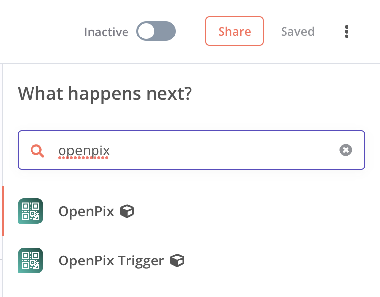

## O que é o N8N + OpenPix?

O N8N é uma ferramenta de automação de fluxo de trabalho que permite que você conecte vários aplicativos e serviços para criar fluxos de trabalho automatizados. O N8N é uma ferramenta de código aberto e gratuita que pode ser executada localmente ou em um servidor.
A OpenPix é uma plataforma de pagamentos e vendas que permite a você: criar cobranças automatizadas, realizar reembolsos e consultar transações e muito mais de forma simples e rápida.

## Como instalar o nó da OpenPix no N8N?

Para encontrar o nó da OpenPix no N8N, você deve:

1. Ir até a aba de configurações
2. Clica em “Community Nodes”
3. Clicar em instalar
4. Pesquisar por `n8n-nodes-openpix`

## O que é possível fazer com o nó da OpenPix no N8N?

Com o nó da OpenPix você consegue:

- Criar cobranças
- Buscar por cobranças (Request Access)
- Reembolsar cobranças (Request Access)
- Realizar saques (Request Access)

## Como configurar o nó da OpenPix no N8N?

Primeiro, dentro do N8N:

1. Clique em “Credentials”
2. Clique em Add Credential
3. Selecione o tipo de credencial “OpenPix API”
4. Preencha o campo de API Key com o seu APP ID
   4.1. Você pode encontrar o seu APP ID na aba de aplicações/plugins ou criar um novo [documentação](../apis/api-getting-started)

## Como criar cobrança usando N8N?

Dentro do seu Workflow, você deve:

1. Buscar pelo nó da OpenPix
   
2. Selecionar a credencial que você criou
3. Preencher os campos de value com o valor desejado da cobrança em centavos
4. Preencher o campo de description com um correlationID único para cada cobrança
