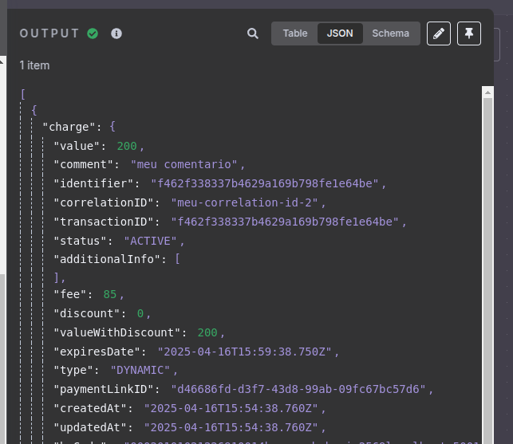
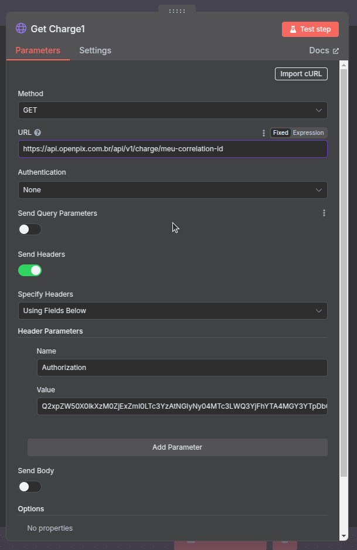
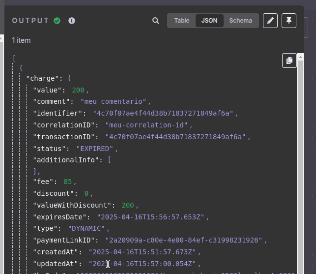
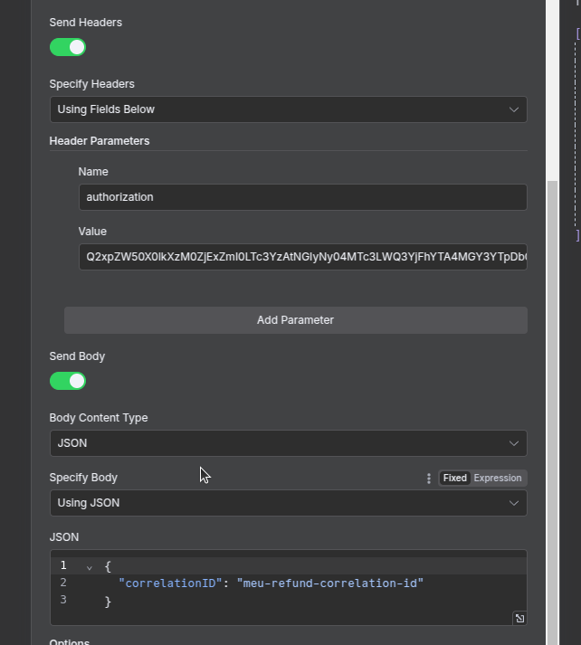
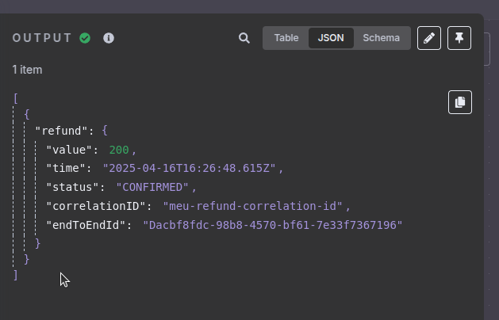
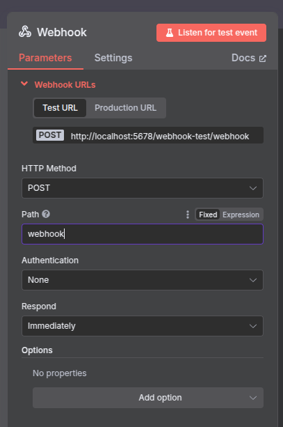
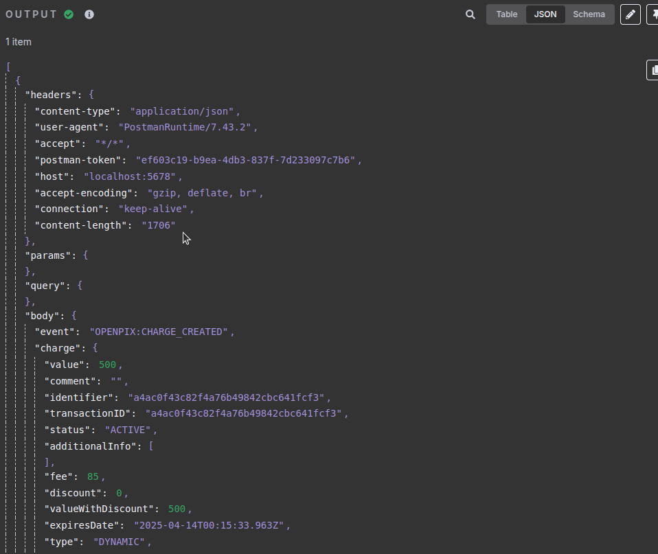

:::info
Antes de começar, certifique-se de ter configurado seu acesso à API da OpenPix. 
Você pode encontrar o guia completo de como obter suas credenciais em nossa [documentação de API Getting Started](https://developers.openpix.com.br/docs/apis/api-getting-started).
:::

## Como integrar o N8N com a OpenPix sem usar o plugin?

Você pode integrar a OpenPix com o N8N utilizando o nó HTTP Request nativo do N8N. Este guia mostrará como configurar e usar os endpoints da API da OpenPix.

### Pré-requisitos

1. Uma conta N8N
2. Seu APP ID da OpenPix (disponível na aba de aplicações/plugins)
3. Acesso à API da OpenPix

## Criando um Workflow para Criar Cobranças

1. Crie um novo workflow no N8N
2. Adicione um nó "HTTP Request"
3. Configure o nó com as seguintes propriedades:
   - Authentication: Matennha em "none"
   - Method: POST
   - URL: `https://api.openpix.com.br/api/v1/charge`
   - Send Headers: true
    - Adicione o header "Authorization" com seu `appID`
   - Send Body: true
   - Body Parameters:
    - Body Content Type: Coloque em "JSON"
    - Specify Body: Use o JSON
   - Adicione o corpo da requisição
```json
{
  "correlationID": "meu-correlation-id",
  "value": 200,
  "comment": "meu comentario"
}
```


Ao clicar em "Test step" você receberá uma saida similar a esta confirmando a criação da cobrança


## Criando um Workflow para Consultar Cobranças

1. Adicione um nó "HTTP Request"
2. Configure o nó com as seguintes propriedades:
   - Authentication: Mantenha em "none"
   - Method: GET
   - URL: `https://api.openpix.com.br/api/v1/charge/MEU_CORRELATION_ID`
    - Substituia na URL o `MEU_CORRELATION_ID` pelo seu id de correlação
   - Send Headers: true
    - Adicione o header "Authorization" com seu `appID`
  - Send Body: false



Ao clicar em "Test step" você receberá uma saida similar a esta confirmando a criação da cobrança


## Criando um Workflow para Reembolsar Cobranças

1. Adicione um nó "HTTP Request"
2. Configure o nó com as seguintes propriedades:
   - Authentication: Mantenha em "none"
   - Method: POST
   - URL: `https://api.openpix.com.br/api/v1/charge/MEU_CORRELATION_ID/refund`
    - Substituia na URL o `MEU_CORRELATION_ID` pelo seu id de correlação
   - Send Headers: true
    - Adicione o header "Authorization" com seu `appID`
   - Send Body: true
   - Body Parameters:
    - Body Content Type: Coloque em "JSON"
    - Specify Body: Use o JSON
   - Adicione o corpo da requisição
     ```json
     {
       "correlationID": "meu-refund-correlation-id"
     }
     ```



Ao clicar em "Test step" você receberá uma saida similar a esta confirmando o reembolso da cobrança


## Criando um Workflow para Escutar Webhooks da OpenPix

O primeiro passo é adicionar um nó "Webhook" ao seu workflow. Este nó será responsável por receber as notificações da OpenPix.

1. Adicione um nó "Webhook" ao seu workflow
2. Configure o nó com as seguintes propriedades:
   - HTTP Method: POST
   - Path: `webhook` (ou qualquer outro caminho que você preferir)



## Configurando o novo Webhook na OpenPix

1. Copie a URL do webhook que o N8N gerou (você pode encontrar esta URL na aba "Test" do nó Webhook)
2. Acesse o [Dashboard da OpenPix](https://app.woovi.com)
3. Vá para a seção "API/Plugins" e clique em "Novo Webhook"
4. Garanta que a opção "Ativo" esteja habilitada, dê um nome para o webhook, configure o tipo de evento a ser escutado e cole a URL do webhook do N8N no campo "URL"
5. Selecione os eventos que você deseja receber notificações. Os eventos disponíveis são:
   - OPENPIX:CHARGE_CREATED - Nova Cobrança Criada
   - OPENPIX:CHARGE_COMPLETED - Cobrança Paga
   - OPENPIX:CHARGE_EXPIRED - Cobrança Expirada
   - OPENPIX:CHARGE_COMPLETED_NOT_SAME_CUSTOMER_PAYER - Cobrança Paga por Outra Pessoa
   - OPENPIX:TRANSACTION_RECEIVED - Transação Pix Recebida
   - OPENPIX:TRANSACTION_REFUND_RECEIVED - Reembolso Concluído
   - OPENPIX:MOVEMENT_CONFIRMED - Pagamento Externo Confirmado (Pix Out)
   - OPENPIX:MOVEMENT_FAILED - Pagamento Externo com Falha (Pix Out)
   - OPENPIX:MOVEMENT_REMOVED - Pagamento Externo Removido (Pix Out)
   - OPENPIX:DISPUTE_CREATED - Disputa Criada
   - OPENPIX:DISPUTE_ACCEPTED - Disputa Aceita
   - OPENPIX:DISPUTE_REJECTED - Disputa Rejeitada
6. Clique em "Salvar"

Ao receber um webhook da OpenPix, você verá uma saída similar a esta:


## Dicas Importantes

1. Sempre use o correlationID único para cada cobrança
2. O valor deve ser enviado em centavos (ex: R$ 10,00 = 1000)
3. O correlationID de refund deve ser diferente do correlationID usado na criação de uma cobrança
4. Teste seus workflows em ambiente de desenvolvimento antes de usar em produção

## Documentação Técnica

Para mais detalhes sobre os endpoints, payloads e respostas da API, consulte nossa [documentação técnica completa](https://developers.openpix.com.br/api).