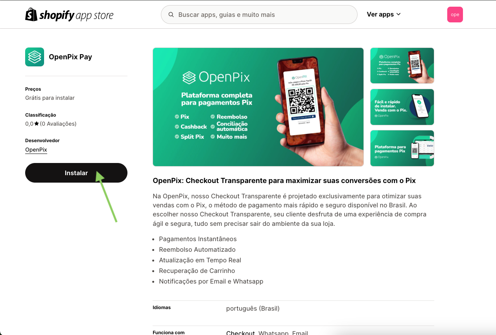
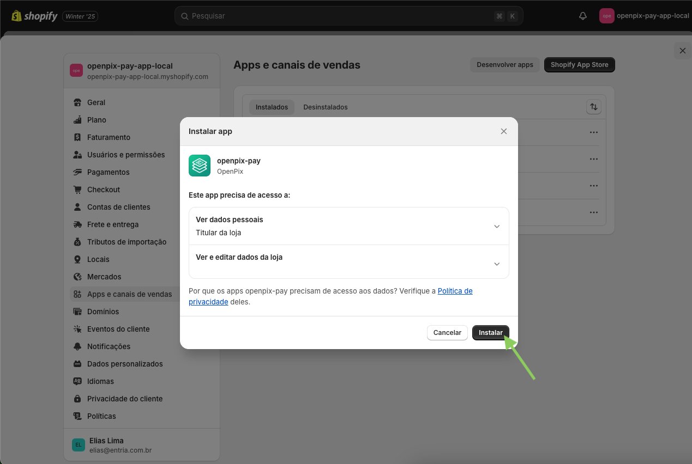
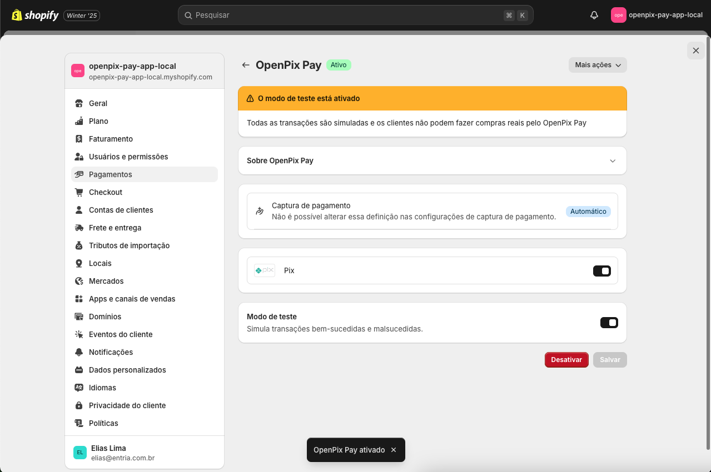

import Embed from 'react-embed';

:::info

O novo aplicativo permite utilizar a nova funcionalidade de Checkout transparente da shopify

:::

## Funcionamento do novo checkout transparente na Shopify

<Embed url='https://www.youtube.com/watch?v=KunqUjHkgU4' />

## 1. Desinstale o antigo aplicativo OpenPix

:::caution

A desinstalação do antigo aplicativo é importante para evitar conflitos entre a nova versão do OpenPix e a Shopify.

:::

Acesse o painel da Shopify e clique na área de Configurações.

No menu lateral, acesse a opção Pagamentos e clique sobre o aplicativo OpenPix.

Clique no botão Desativar.

Confirme a desativação clicando novamente em Desativar.

Após desativar, clique no botão Desinstalar.

Confirme a desinstalação clicando em Desinstalar.

Pronto! O aplicativo foi desinstalado com sucesso. Agora podemos prosseguir com a instalação da nova versão.

## 2. Instalar o novo aplicativo OpenPix Pay

Para integrar sua loja Shopify com a OpenPix, é necessário instalar o aplicativo OpenPix diretamente pela Shopify.

- Acesse nosso aplicativo na Shopify: [OpenPix Pay](https://apps.shopify.com/openpix-pay-app-prod)

Após acessar a página inicial, selecione a loja que deseja instalar o aplicativo:

Após selecionar a loja, clique em Instalar:

O Shopify irá redirecioná-lo para o painel de instalação do aplicativo.

Clique novamente no botao `Instalar`. Você será redirecionado para nossa plataforma, e a integração acontecerá de forma automática.

:::info

Caso não esteja logado na plataforma, basta continuar a autenticação e o fluxo de instalação seguirá automaticamente.

:::

Após a integração dentro de nossa plataforma ser concluída, você será redirecionado novamente para o Shopify para ativar o aplicativo.

:::caution

Caso a instalação seja feita em uma loja de produção, desabilite o modo de teste.

:::

Basta clicar em Ativar, e estará pronto para utilizar.

