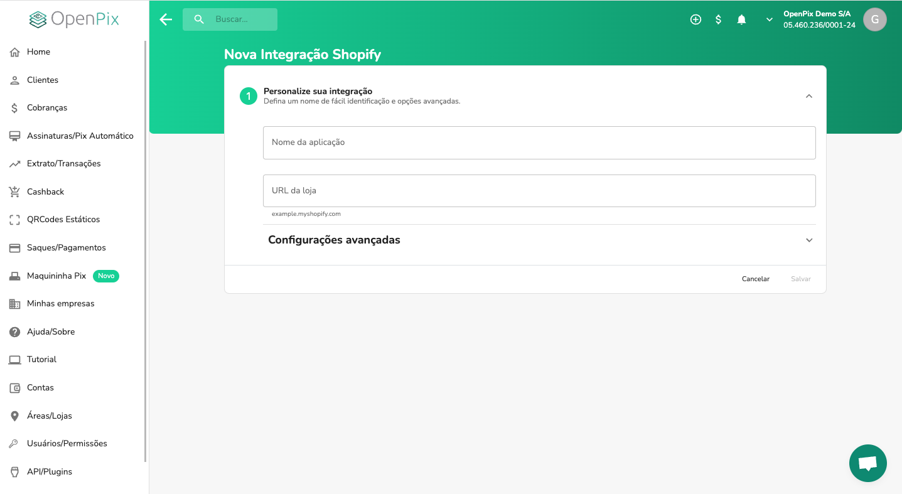
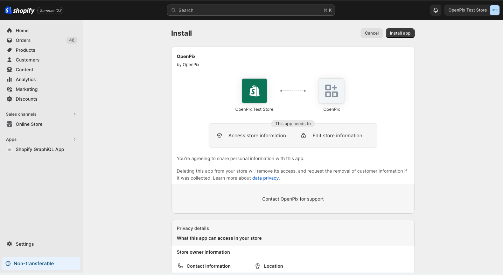
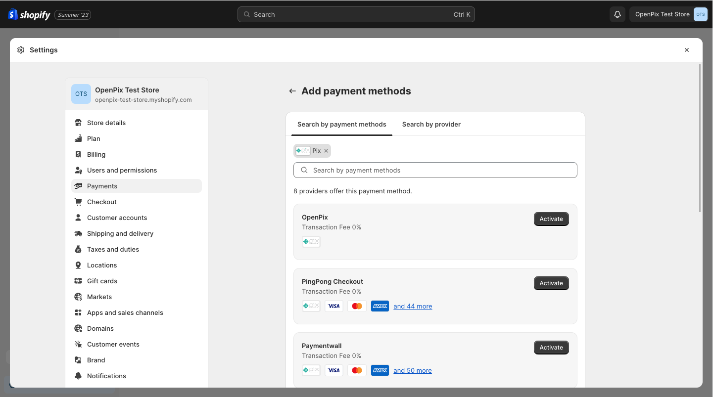
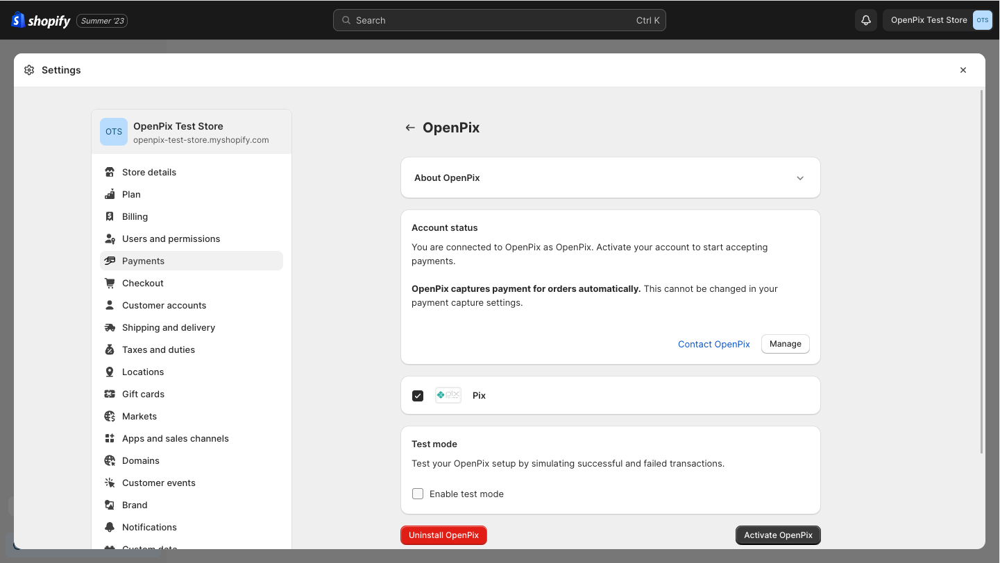

:::caution

Essa documentação espera que você já tenha uma loja Shopify ativa e uma conta criada na OpenPix.

:::

## 1. Criando uma nova aplicação

Para integrar sua loja Shopify com a OpenPix, é necessário criar uma aplicação relacionada a essa integração.

Para criar uma nova aplicação, você pode seguir um dos seguintes passos:

- Acessando diretamente o formulário de criação, clicando [aqui](https://app.openpix.com/home/applications/shopify/add);
- Após acessar a plataforma da [OpenPix](https://app.openpix.com/home), você pode acessá-lo através do menu, clicando em:
  1. API/Plugins;
  2. Shopify;
  3. Clique no botão `Adicionar`;

Após seguir um desses fluxos, você será redirecionado para o formulário de criação da aplicação, conforme a imagem abaixo:

Após preencher as seguintes informações:

1. **Nome da aplicação**: o nome pelo qual você quer identificar essa integração dentro da OpenPix;
2. **URL da loja**: a URL da sua loja no Shopify. Exemplo: `example.myshopify.com`.

Você pode clicar no botão `Salvar` e a aplicação será criada. Após a criação, você será redirecionado para a
Shopify onde dará prosseguimento à instalação e integração do aplicativo.

:::info

Permitimos somente uma integração relacionada com aquela URL de loja. Caso você tente criar uma nova aplicação
com a mesma URL de loja, não permitiremos.

:::

## 2. Instalando a aplicação na Shopify

Após ser redirecionado para a Shopify, você será solicitado a instalar o aplicativo. Você será redirecionado
para a tela a seguir:

Clique no botão `Install app`, no canto superior direito, para autorizar e prosseguir com a instalação.

Após clicar, caso o processo de autenticação tenha ocorrido de forma correta, você será redirecionado para o detalhe
da aplicação na Shopify. Deste modo, sua instalação foi concluída corretamente.

Para estar utilizando o Pix da OpenPix como método de pagamento na sua loja será necessário habilitar o mesmo como
um método de pagamento da sua loja.

## 3. Habilitando o App como método de pagamento

Para habilitar o Pix como método de pagamento, você deve acessar o menu `Configurações` e clicar em `Pagamentos`.

1. Na seção de `Métodos de Pagamentos Adicionais`,  clique no botão: `Adicionar método de pagamento`.
2. Na aba de procurar por métodos de pagamento, digite `Pix`.
3. Busque o método de pagamento `OpenPix`.
4. Clica no botão `Ativar`.

Depois de clicar em `Ativar`, você será direcionado para a página de detalhe daquele método de pagamento. Para ativar
a OpenPix, basta clicar no botão `Ativar OpenPix`, no canto inferior direito, conforme a imagem abaixo:

## 4. Concluindo a ativação

Depois que você clicou no botão `Ativar OpenPix`, você já pode começar a receber pagamentos via Pix na sua loja Shopify!

No checkout da sua loja, estará disponível o método de pagamento `Pix (OpenPix)` e seus clientes poderão estar utilizando-o.
