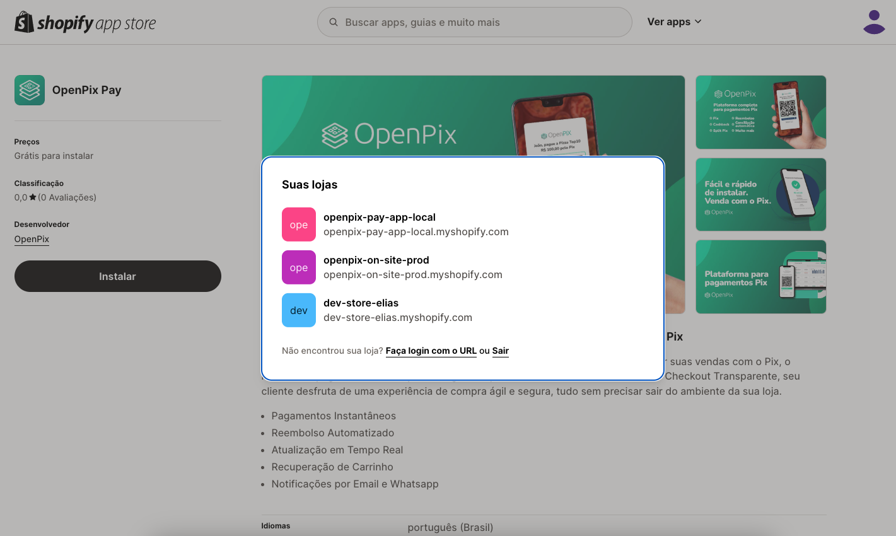

:::caution

Essa documentação espera que você já tenha uma loja Shopify ativa e uma conta criada na OpenPix.

:::

## 1. Instalando o aplicativo OpenPix através do Shopify

Para integrar sua loja Shopify com a OpenPix, é necessário instalar o aplicativo OpenPix diretamente pela Shopify.

- Acesse nosso aplicativo na Shopify: [OpenPix Pay](https://apps.shopify.com/openpix-pay-app-prod)

Após acessar a página inicial, selecione a loja que deseja instalar o aplicativo:

Após selecionar a loja, clique em Instalar:

O Shopify irá redirecioná-lo para o painel de instalação do aplicativo.

Clique novamente no botao `Instalar`. Você será redirecionado para nossa plataforma, e a integração acontecerá de forma automática.

:::info

Caso não esteja logado na plataforma, basta continuar a autenticação e o fluxo de instalação seguirá automaticamente.

:::

Após a integração dentro de nossa plataforma ser concluída, você será redirecionado novamente para o Shopify para ativar o aplicativo.

Basta clicar em Ativar, e estará pronto para utilizar.

:::info

Permitimos somente uma integração por loja.

:::
