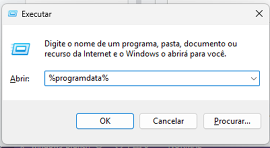
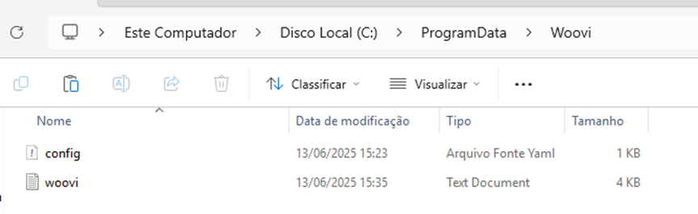
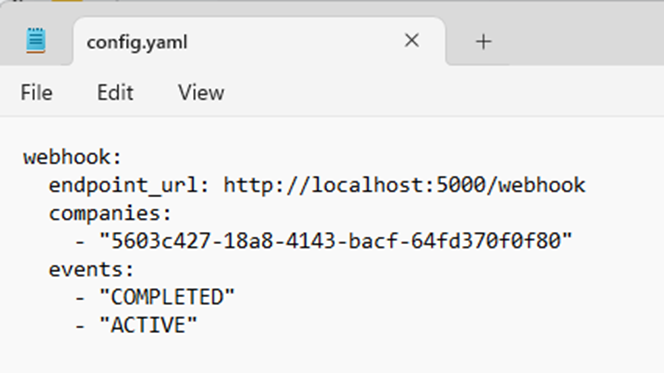

## O que é a Woovi Bridge?

O Woovi Bridge permite que aplicações sem urls/endpoints expostos na internet recebam webhook localmente.
- Casos de uso: PDV, sistemas embarcados, IoT.

### Como as informações são mandadas?
As informações são recebidas pela nossa aplicação e são mandadas em uma requisição POST para seu endpoint.
O corpo da requisição tem o seguinte formato:

```json
{
"value":5400,
"company":{"nameFriendly":"...","correlationID":"..."},
"identifier":"...",
"status":"COMPLETED",
"expiration":2592000,
"createdAt":"2025-06-11T14:33:58.679Z",
"paidAt":"2025-06-11T14:34:59.000Z",
"paymentLinkID":"..."
}
```

### Quais configurações posso fazer?
Essas são as configurações de webhook que são possíveis, colocando quais tópicos, qual endpoint e quantas vezes tentar novamente mandar a requisição caso falhe:

```json
webhook:
  endpoint_url: "http://localhost:3000/woovi"
  companies:
    - "companyCorrelationId"
    - “companyCorrelationId2”
  events:
    - “COMPLETED”
    - “ACTIVE”
```

### O que são os Companies?
As companies é uma configuração que você utiliza o correlationId de uma company para dizer que quer receber informações dela.
Você pode receber informações de quantas empresas diferentes quiser por meio das Companies.
- A estrutura padrão da configuração é:

```json
companies:
- "{correlationId1}"
	- "{correlationId2}"
```

### Como conseguir um CorrelationID?
O correlationID representa uma empresa em nosso sistema, você pode identificá-la por esse valor único.
- Por meio de nossa API você tem acesso a esse valor:

```json
curl -X GET "https://api.woovi.com/api/v1/company" \
  -H "Authorization: {APP_ID}"
```
Nosso sistema retornará as informações da company atrelada ao seu AppID que foi mandado no Header, em forma de JSON:

```json
{
	"officialName": "...",
	"tradeName": "...",
	"taxID": "...",
	"correlationID": "...",
}
```

### Endpoint

O endpoint precisa ser um endpoint já configurado em sua aplicação, ele tem que estar configurado para poder receber requisições HTTP POST.
Nossa aplicação espera uma resposta 200. Caso não receba 200, ele enviará a mensagem novamente seguindo as configurações de retry.

Exemplo de endpoint:

` endpoint_url: "http://localhost:3000/webhook" `

### Configurações de Eventos

As configurações de eventos permitem que você pegue informações de estados diferentes de uma cobrança.
Os possíveis eventos são:

 - COMPLETED
 - ACTIVE
 - COMPLETED: Evento que é disparado quando uma cobrança é paga.
 - ACTIVE: Evento que é disparado quando uma cobrança é criada.

 O arquivo de configuração permite que você configure esses eventos da seguinte forma:
 ```json
 events:
- "COMPLETED"
- "ACTIVE"
```

### Como iniciar a aplicação?
Você receberá um instalador, esse instalador irá configurar tudo que é necessário para que nossa aplicação funcione.
Tudo que você precisa fazer após a instalação é colocar seus dados no arquivo de configuração.

## Como configurar?
Pressione a tecla Windows + R. Ou seja, pressione a tecla Windows e ao mesmo tempo a tecla R do teclado.



Nessa caixa de texto você só precisa colocar: %programdata%
 - Pressione ENTER.

Procure a pasta `Woovi` e entre nela.
Nessa pasta terá dois arquivos, abra o arquivo `config.yaml`



O arquivo se parecerá com este exemplo:



Agora basta colocar as informações dos passos anteriores.
Após salvar o arquivo, reinicie o Computador.

:::note
O outro arquivo na pasta, o `woovi.txt` é onde os logs da aplicação serão guardados.
Caso hajam erros você pode conferir nesse arquivo.
:::


