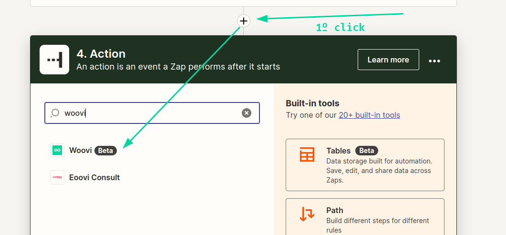
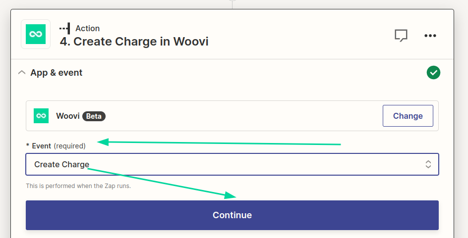
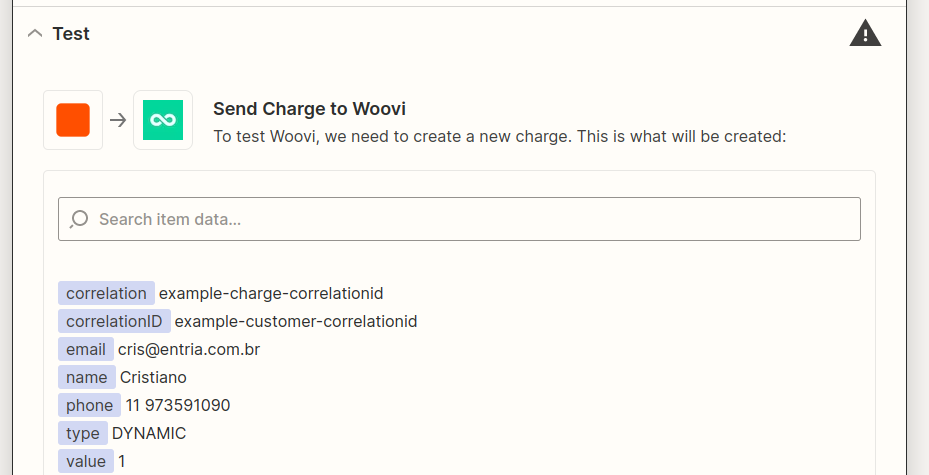
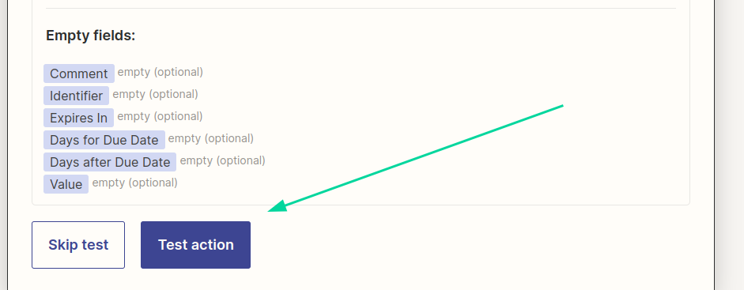
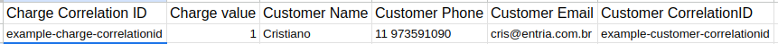

A [Zapier](https://zapier.com) é uma plataforma poderosa que viabiliza a integração fluida de mais de 5.000 aplicativos diversos em fluxos de trabalho automatizados e interconectados.

Com o selo oficial da Woovi, [o nosso aplicativo](https://zapier.com/apps/woovi/integrations) está agora disponível na ampla gama de apps listados na Zapier. Isso abre a porta para a integração dos serviços de Pix com outras aplicações, incluindo, por exemplo, a capacidade de sincronizar dados com planilhas do Google e envio de notificações no Slack.

## O que você pode alcançar?

Ao aproveitar o aplicativo da Woovi, você desbloqueia um universo de oportunidades. Aqui estão alguns exemplos de integrações práticas:

- Notificações no Slack: Receba alertas instantâneos no Slack para novas cobranças na Woovi.
- Registro em Planilhas Google: Mantenha registros automáticos de novos clientes em planilhas Google.
- Integração com Email Marketing: Adicione automaticamente novos clientes da Woovi à sua lista de contatos de email marketing.
- Gerenciamento de Reembolsos: Envie notificações de reembolso aos clientes e mantenha registros internos.
- Sincronização Financeira: Crie entradas financeiras em plataformas como QuickBooks para novas cobranças na Woovi.

## Ações e gatilhos

Nosso aplicativo possui as seguintes [ações](https://help.zapier.com/hc/en-us/articles/8496257774221-Set-up-your-Zap-action) (_actions_) que você pode utilizar em conjunto com outros aplicativos:

- Criar uma cobrança
- Remover uma cobrança
- Criar um cliente
- Criar reembolso de uma cobrança

Você também pode utilizar o [gatilho](https://help.zapier.com/hc/en-us/articles/8496244568589-Types-of-triggers-in-Zaps) (_trigger_) de webhook, que permite ativar outras ações (como enviar uma notificação no Slack) quando um evento acontece (como uma cobrança sendo paga).

## Autenticação

Ao utilizar alguma triger ou action da Woovi em seu fluxo no Zapier, é necessário se autenticar.

Isso é realizado na seção _Account_, através do botão _Sign In_:

Ao apertar esse botão, uma nova janela será aberta, onde você deverá adicionar o seu _App ID_ e um nome para sua conta (no campo _App name_).

## Ações

### Como adicionar uma ação da Woovi

Em seu fluxo Zapier, [adicione uma nova ação](https://help.zapier.com/hc/en-us/articles/8496257774221-Set-up-your-Zap-action) pesquisando por _Woovi_ no início de sua _action_:

Agora é necessário selecionar um evento, que diz qual ação tomar. Por exemplo, aqui estamos selecionando o evento _Create charge_ para criação de uma cobrança:

Devemos estar na seção _Account_ no momento, onde a autenticação deve ser feita.

Após a autenticação, é o momento de configurar sua action na seção _Action_, de acordo com o evento dela:

Tendo configurado a nossa action, agora você deve estar na seção _Test_ para testes da action:

Ao apertar o botão _Test action_ você efetuará o teste dela:

### Como criar uma cobrança?
Neste cenário de exemplo, faremos uso do Google Planilhas. Aqui, uma planilha de cobranças será configurada, onde cada nova linha inserida resultará na geração automática de uma cobrança.

Em primeiro lugar, crie uma planilha com os seguintes campos e adicione uma nova linha:

Após isso crie um [Zap](https://help.zapier.com/hc/en-us/articles/8496309697421-Create-Zaps) com o trigger _Ǹew Spreadsheet Row_ (nova linha na planilha) do app [Google Sheets](https://www.google.com/sheets/about/).

Tendo configurado e testado a trigger, adicione uma nova action da Woovi com o evento _Create charge_ (criar cobrança).

Ajuste os campos da ação na seção _Action_ de forma a coincidirem com as colunas da planilha:

No campo `Type` selecione `DYNAMIC` para criação de uma cobrança à vista.

Após isso, prossiga para a seção _Test_ para testar o seu fluxo.

### Como remover uma cobrança?

### Como criar um cliente?

### Criar reembolso de uma cobrança?

## Gatilhos
### Como configurar o webhook?