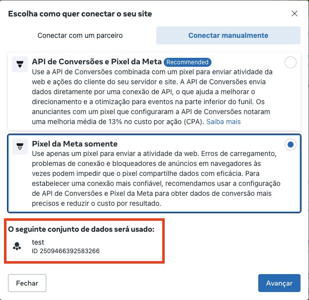

O **Meta Pixel** (anteriormente conhecido como **Facebook Pixel**) é uma ferramenta que permite monitorar e rastrear as ações dos visitantes em seu site, fornecendo dados valiosos para campanhas de marketing, otimizações de anúncios e remarketing no Facebook.

Neste guia, você aprenderá como criar e configurar um Meta Pixel para o seu site e como integrá-lo usando React.

## Passos para Criar um Meta Pixel

### 1. Acessar o Gerenciador de Eventos do Facebook

1. Vá para o [Gerenciador de Eventos do Facebook](https://www.facebook.com/events_manager2).
2. No painel esquerdo, clique em **Conectar Fontes de Dados** e selecione **Web**.
3. Nomeie o seu **Meta Pixel** com algo identificável, como o nome do seu site ou campanha.

<!-- conectar manualmente, pixel da meta somente -->
### 2. Configuração de como conectar o Pixel

1. Selecione a opção **Conectar manualmente**.
2. Escolha a opção **Pixel da Meta somente**.

Antes de continuar, você precisará **copiar o ID do Pixel** para cadastra-lo na plataforma.

O ID do pixel está na **parte de baixo** junto ao nome do pixel que você acabou de criar.

