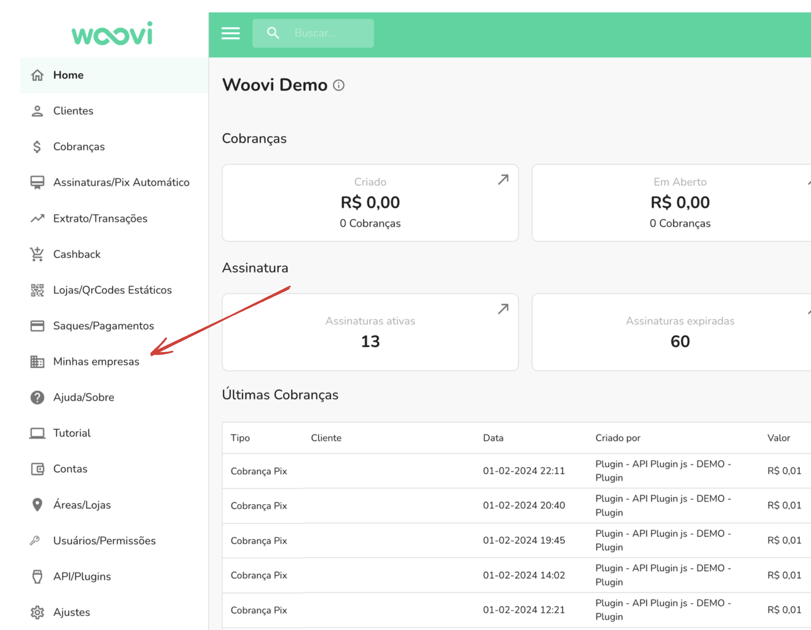
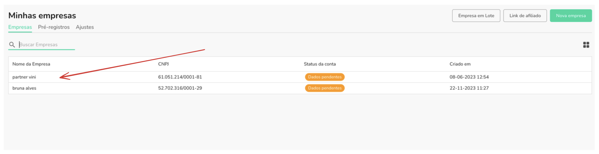
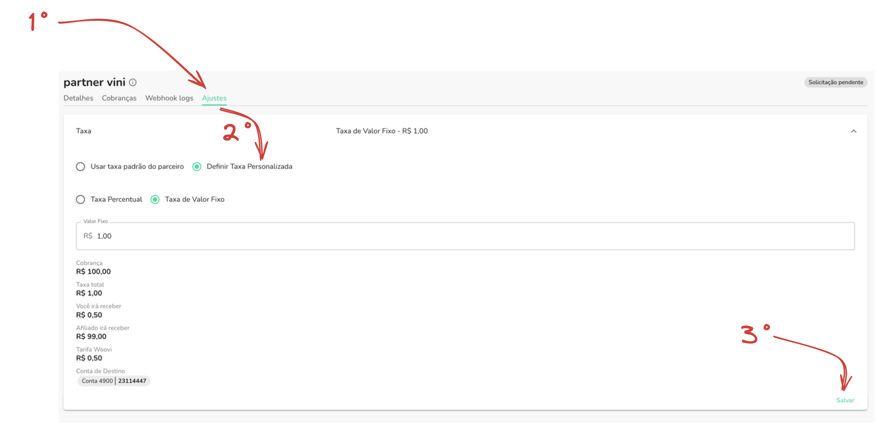

:::info
Para você ter acesso a essa funcionadade você precisa ser parceiro da OpenPix.
:::

Acesse `Minhas empresas` via sidebar menu

Acesse o detalhe do afiliado que você deseja configurar uma taxa customizada.

- Acesse a aba `Ajustes`.
- Selecione a opção `Definir Taxa Personalizada`.
- Configure a taxa que você deseja.
- E logo em seguida, aperte o botão de `Salvar` para confirmar sua alteração.

