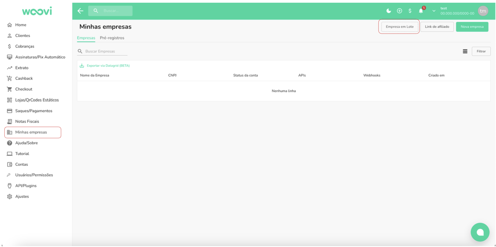
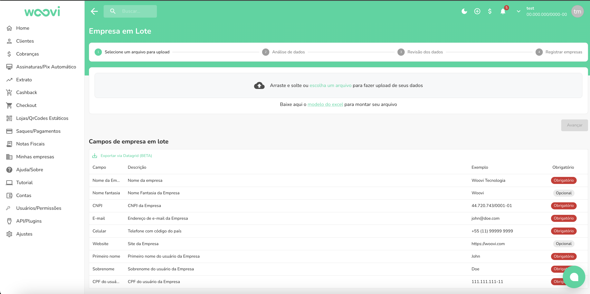
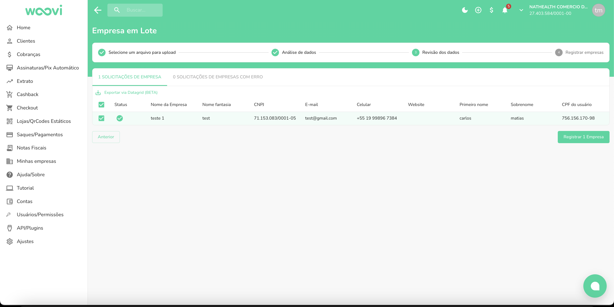

## Fazendo o registro das contas

Existe situações onde é necessário que o parceiro consiga registrar várias empresas ao mesmo tempo.

Cenário: Um delivery quer usar a woovi e tem 200 parceiros. Como viabilizar essa operação rapidamente?

Na plataforma em `Minhas empresas`, clique no botão de `Empresa em lote`

O template está disponível na plataforma.

Após enviar os dados:

