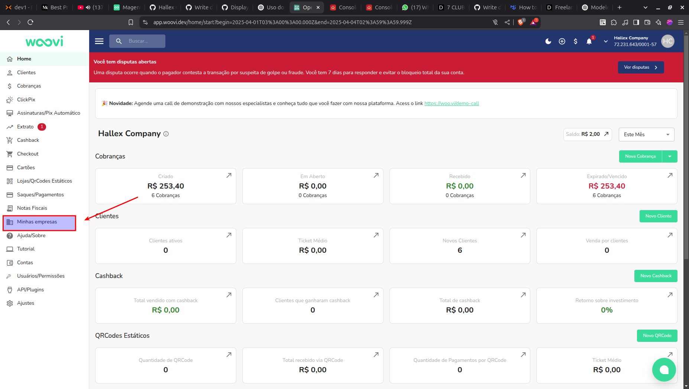
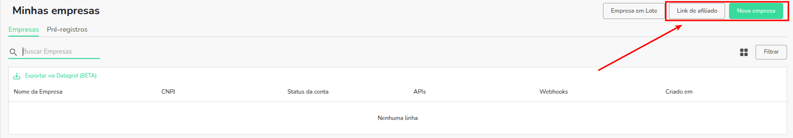
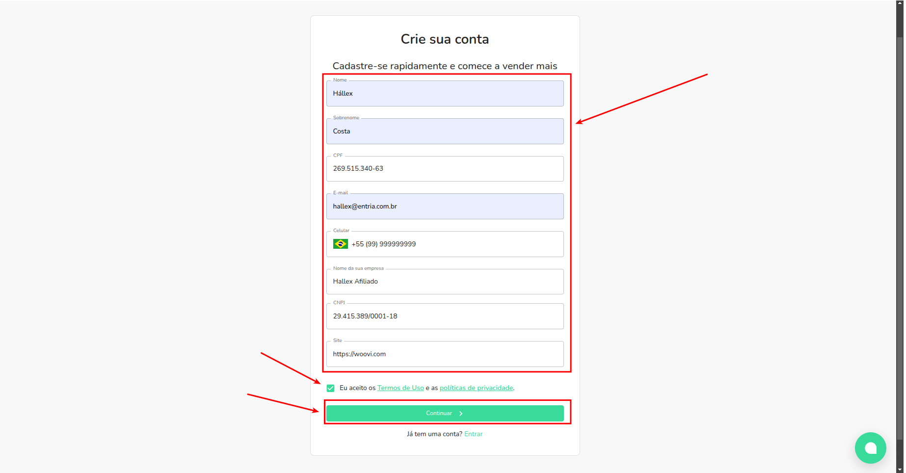
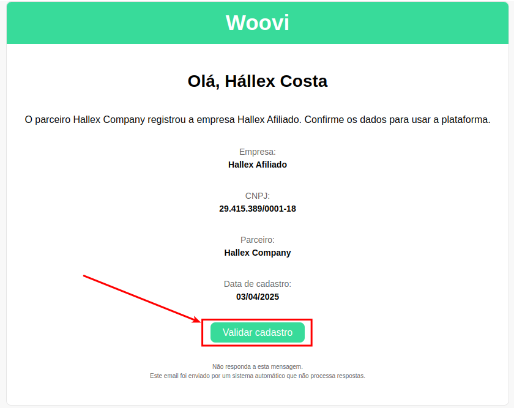
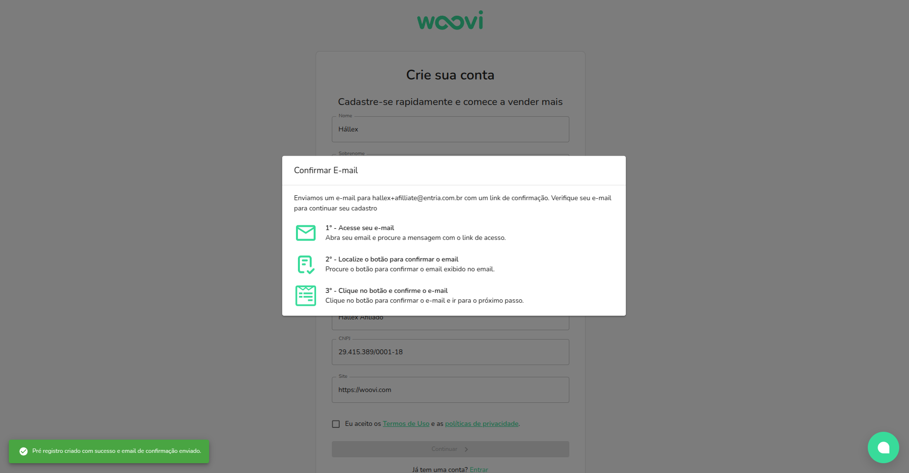
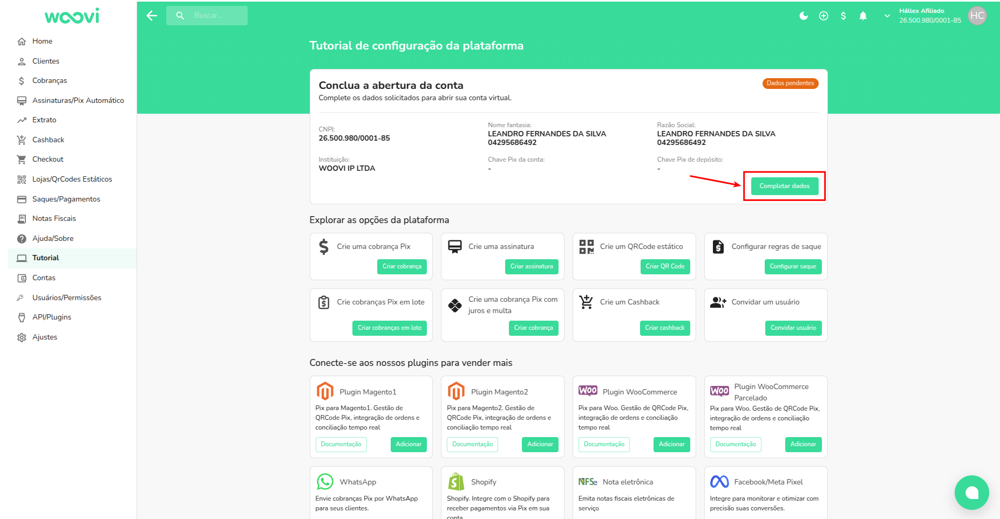
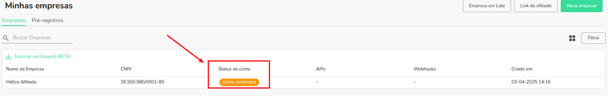
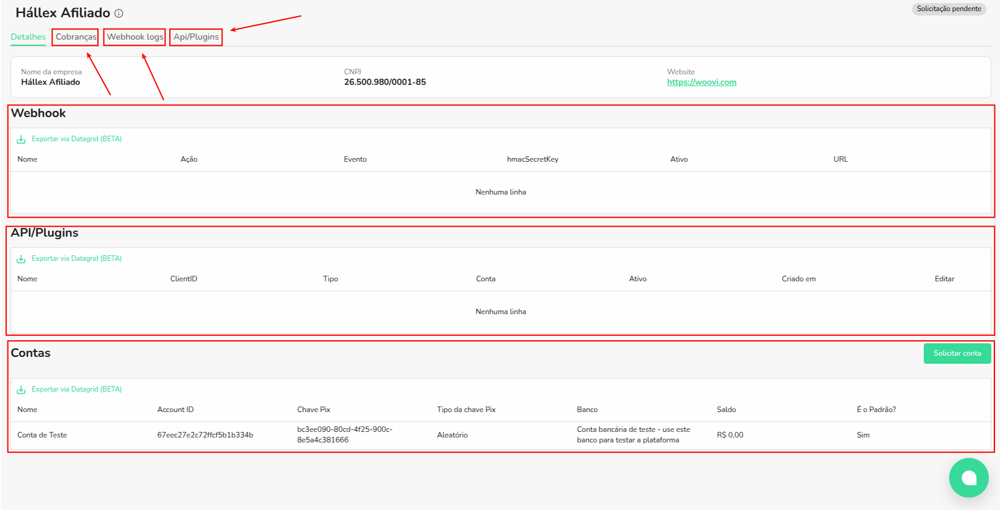
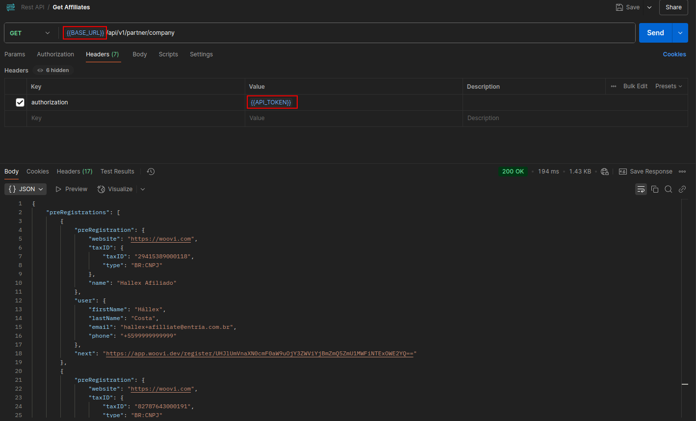
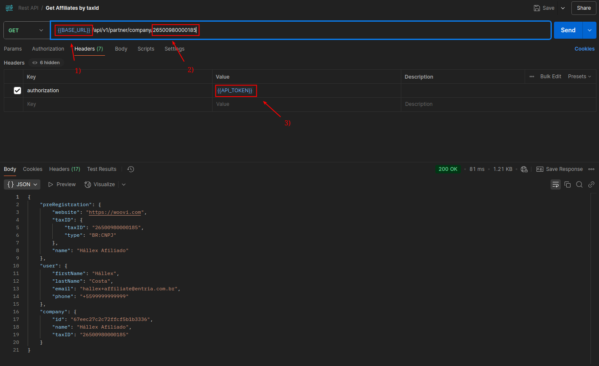

:::info
Antes de seguir com a integração como parceiro você precisa solicitar a ativação dessa funcionalidade em sua conta através do nosso suporte
:::

### Dashboard

1) Acesse o nosso dashboard, no lado direito clique em "Minhas Empresas"

2) Após a acessar a área "Minhas Empreas", você poderá visualizar duas abas e dois botões
Abas:
- Empresas
> Onde estará todas as empresas que finalizaram o pŕe-cadastro como seu afiliado
- Pré-registro
> Onde você verá todas as empresas que iniciaram um pré-cadastro como seu afiliado, porém não completaram a validação e ativação da conta

Botões:
- Link de Afiliado
Onde você poderá usar para copiar o link de pré-cadastro e enviar para algum afiliado seu efetuar um pré-registro de conta
O link de afiliado é algo parecido com:
https://app.woovi.com/register?partner=Q29tcGFue23AdDLOK2NhZGVjZTZkMzQ4MTQ3MzEyZDc=

- Nova Empresa
Onde você pode criar um pré-registro para alguma empresa que deseja se tornar sua afiliada
Você pode fazer a criação da nova empresa através da nossa API, para saber mais bastar seguir a seção [Como criar um afiliado via API](#como-criar-um-afiliado-via-api)

## Pré-registro de conta de um Afiliado

1) Após enviar o link para seu afiliado ou você clicar em novas empresa, ele/você poderá cadastrar na Woovi essa conta será vinculado a sua empresa
> É importante que o afiliado preenchas todas as informações obrigatorias do formulário, aceite os termos e clique em continuar para seguir com a criação da conta de afiliado

Um link de validação será enviado para o email do afiliado cadastrado, após ele acessar o email ele poderá clicar e "Validar cadastro"

2) Ele será redirecionado para a plataforma da woovi novamente, e solicitare-mos um código de validação de número de telefone que sera enviado para ele via SMS ou Whatsapp dele

3) Após o afiliado se cadastrar terá acesso a uma conta na Woovi como seu afiliado
> Solicite para ele completar os dados de cadastrado dele

4) Você poderá visualizar todas a empresas cadastradas como seu afiliado, também poderá ver quais empresas não completaram seu cadastro após a criação da conta

Ao selecionar um afiliado, você terá acesso a todas as informações daquele afiliado como

- Cobranças
- Webhooks logs
- Api/Plugins
- Contas
- Ajustes

## Configuração de taxas via Dashboard

Você também pode customizar taxas de forma personalizada, siga a documentação abaixo para saber mais sobre:

:::info
Caso você não consiga visualizar a aba ajustes em "Minhas Empresas" ou nas suas empresas afiliadas, solicite a ativação para nosso suporte
:::

- [O que é taxa customizada?](./custom-fee/what-is.md)
- [Como customizar a taxa de um afiliado?](./custom-fee/how-to-customize-the-fee-for-a-affiliate)

## Como criar um afiliado via API
Você também pode criar chaves de APIs e webhooks para suas empresas afiliadas, seguindo a documentação abaixo

- [Como acessar a API com uma empresa afiliada?](./how-to-access-api-via-affiliated-company.md)
- [Como criar um webhook para uma empresa afiliada?](./how-to-create-a-webhook-to-affiliated-company.md)

## Como criar um appID para seu afiliado via API
Você pode criar chaves de APIs para suas empresas afiliadas, seguindo a documentação abaixo

- [Como acessar a API com uma empresa afiliada?](./how-to-access-api-via-affiliated-company.md)

## Como listar todos afiliados via API

Você pode fazer um chamada para o nosso endpoint `/api/v1/partner/company` informando o seu `appID` utilizando os header de `Authorization`
Para saber mais sobre as especificações do nosso endpoint você pode acessar [nossa documentação tecnica](https://developers.openpix.com.br/api#tag/partner-(request-access)/paths/~1api~1v1~1partner~1company/get)

1. Troque `BASE_URL` pela URL de produção `https://api.openpix.com.br`
3. Adicione um appID ao header authorization da requisição.

Caso ainda não tenha um `appID`, recomenda-mos fortemente você consultar nossa documenta de [começando uma integração](../apis/api-getting-started.md)

## Como listar um afiliado especifico?

Você pode fazer um chamada para o nosso endpoint `/api/v1/partner/company/{taxID}` informando o seu `appID` no header de `Authorization` da sua requisição, e também substituido o parâmetro `taxID` pelo CNPJ do seu afiliado pré-registrado
Para saber mais sobre as especificações do nosso endpoint você pode acessar [nossa documentação tecnica](https://developers.openpix.com.br/api#tag/partner-(request-access)/paths/~1api~1v1~1partner~1company~1%7BtaxID%7D/get)

1. Troque `BASE_URL` pela URL de produção `https://api.openpix.com.br`
2. Troque os números pelo seu que estão definidos na URL pelo CNPJ do seu afiliado
3. Adicione um appID ao header authorization da requisição.

:::info
Caso ainda não tenha um `appID`, recomenda-mos fortemente você consultar nossa documenta de [começando uma integração](../apis/api-getting-started.md)
:::
