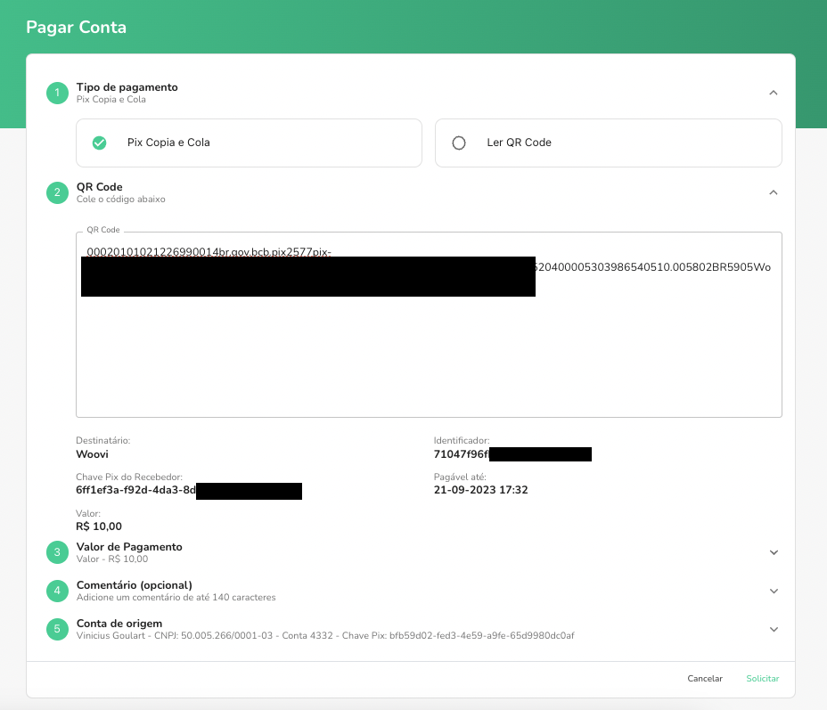
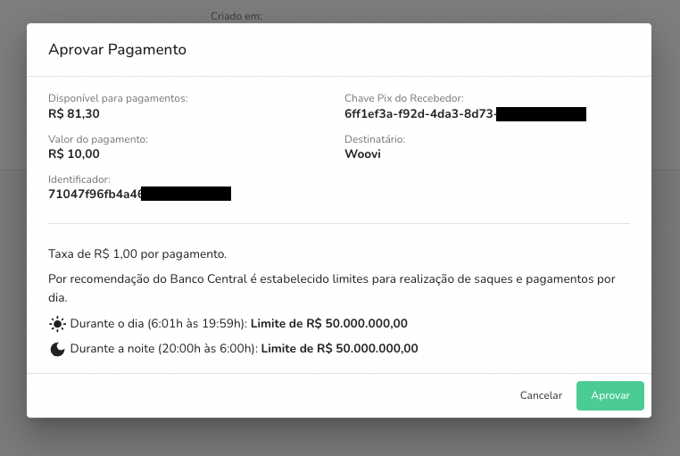

Você pode pagar suas contas por pix utilizando a plataforma. Com isso você consegue pagar uma conta diretamente com o seu saldo na plataforma.

Para pagar contas utilizando a sua empresa siga os passos abaixo:

## 1. Solicitar o Pagamento de uma Conta

- Acesse `Saques e Pagamentos` via sidemenu
- Clique em `Pagar Conta`
- Preencha os campos informados

| Campo              | Descrição                                                                   |
| ------------------ | --------------------------------------------------------------------------- |
| Tipo de pagamento  | tipo do pagamento, copiar qr code ou ler qr code                            |
| QR Code            | código do qr code                                                           |
| Valor de Pagamento | valor total do pagamento, preenchido automaticamente ao preencher o qr code |
| Comentário         | comentário opcional que será enviado junto ao pagamento                     |
| Conta de origem    | conta de origem que vai realizar o pagamento                                |

- Clique em `Solicitar`

## 2. Aprovar o Envio de um Pagamento

- Acesse `Saques e Pagamentos` via sidemenu
- Clique na aba de `Solicitações de Pagamentos`
- Clique na Solicitação a ser aprovada
- Clique em `Aprovar Pagamento`
- Confira os dados informados
- Clique em `Aprovar`

