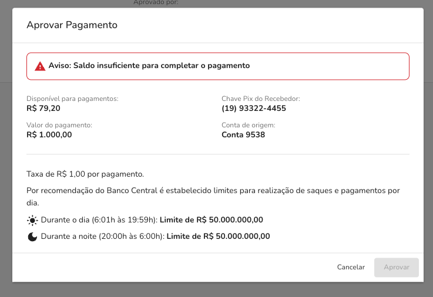

Para realizar Pagamentos em sua empresa siga os passos abaixo:

## 1. Ativar Permissões para Pagamentos na Conta

- Acesse `Contas` via sidemenu
- Clique em `Detalhes da Conta` na conta que deseja realizar pagamentos
- Clique na aba de `Ajustes`
- Na seção de `Pagamentos` habilite a opção de `Permitir que a conta possa realizar pagamentos`

## 2. Solicitar o Envio de um Pagamento

- Acesse `Saques e Pagamentos` via sidemenu
- Clique em `Solicitar Pagamento`
- Preencha os campos informados

| Campo                  | Descrição                                               |
| ---------------------- | ------------------------------------------------------- |
| Chave Pix do Recebedor | chave pix destinatária do pagamento                     |
| Valor de Pagamento     | valor total do pagamento                                |
| Comentário             | comentário opcional que será enviado junto ao pagamento |
| Conta de origem        | conta de origem que vai realizar o pagamento            |

- Clique em `Solicitar`

## 3. Aprovar o Envio de um Pagamento

- Acesse `Saques e Pagamentos` via sidemenu
- Clique na aba de `Solicitações de Pagamentos`
- Clique na Solicitação a ser aprovada
- Clique em `Aprovar Pagamento`
- Confira os dados informados
- Clique em `Aprovar`

## Saldo insuficiente ao aprovar pagamentos via Plataforma
Ao tentar realizar a aprovação de um pagamento via plataforma e estiver sem saldo o modal será exibido com a seguinte informação:

Na plataforma o pagamento continuará com o status solicitado sendo possível realizar a aprovação do mesmo quando houver saldo suficiente.

