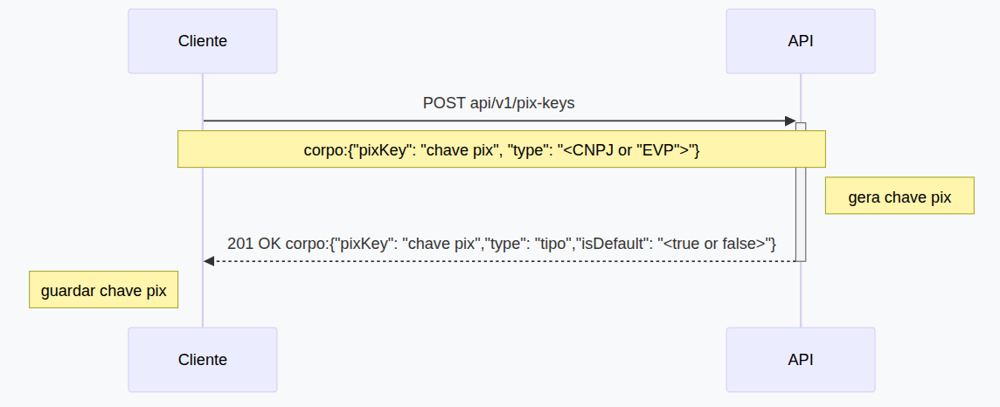

## Como criar uma nova Chave Pix via api

Este documento irá ajudar a entender como criar uma chave Pix.



## 1. Montando a requisição.
  * Utilize o endpoint de chave pix para criar uma nova chave pix
  * Utilize o appId para autenticar a requisição.
  * Faça a requisição.
  ```JSON
   curl -X POST "https://api.openpix.com/api/v1/pix-keys" \
     -H "Authorization: <appId>" \
     -H "Content-Type: application/json" 
     --data-raw '{
        "pixKey": "<chave pix>",
        "type": "<tipo da chave pix 'CNPJ', ou 'EVP' (nesse caso não é nescessário enviar a chave pix, visto que será uma chave aleatória)>"
      }'
  ```

  * Caso tudo ocorra corretamente, um código 201 será retornado.
  * No corpo da resposta terá:
  ```JSON
    {
      "pixKey": {
        "pixKey": "<chave pix>",
        "type": "<tipo da chave pix>",
        "isDefault": true
      }
    }
  ```

OBS: para criar chaves pix do tipo "PHONE" ou "EMAIL", é necessário ter permissão especial. 
Caso deseje, entre em contato com o suporte e solicite a permissão.

