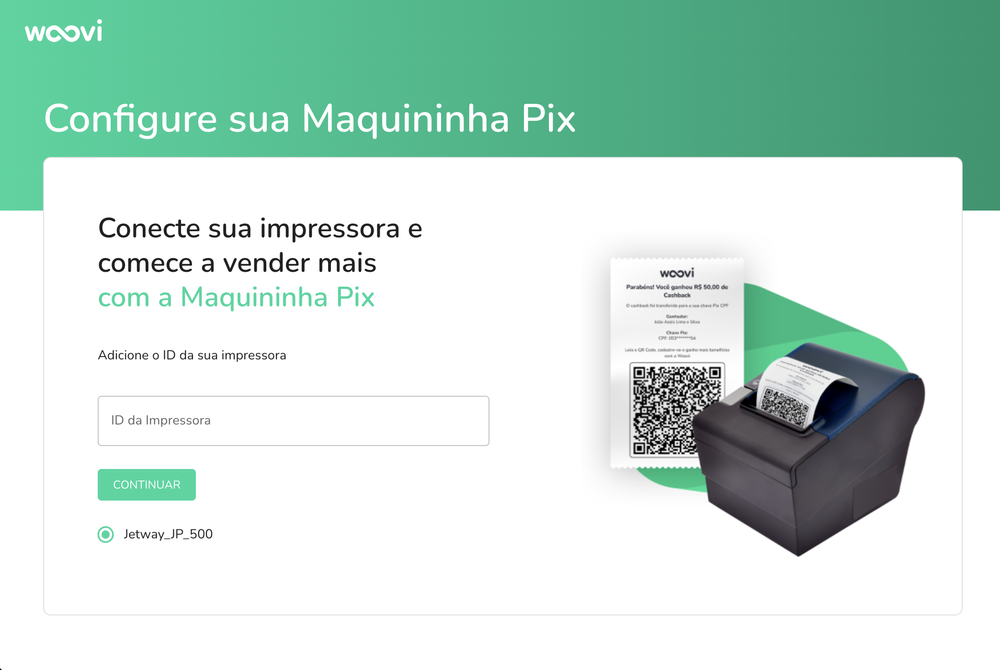
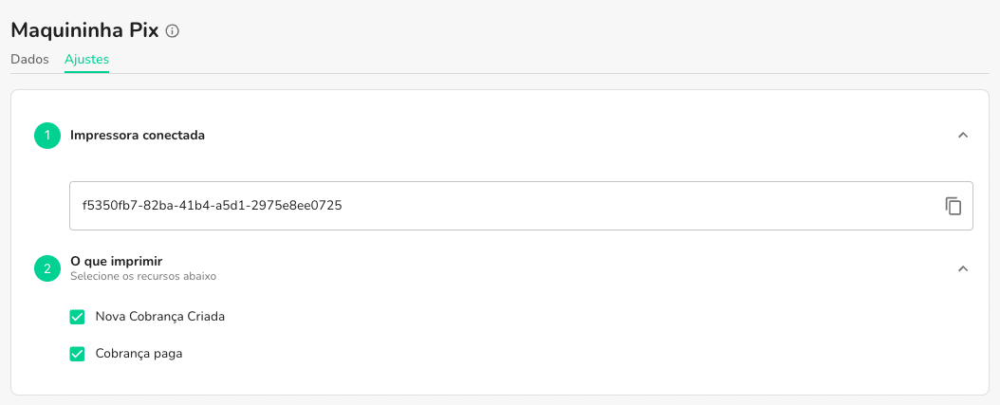

import Embed from 'react-embed';

:::info
É esperado que você já possua conta com a OpenPix, caso não tenha, [clique aqui](https://ajuda.openpix.com.br/pt-br/article/como-cadastrar-minha-empresa-14e7lwx/) para saber como criar uma conta.
:::

:::info
Para instalar a Maquininha PIX, você precisa de uma impressora térmica conectada em seu computador. Caso sua maquininha térmica não esteja conectada, [clique aqui](setup-pix-machine.md) para saber como conectar
:::

## Como instalar a Maquininha PIX

A Maquininha PIX é um produto da Woovi que permite que você gere cobranças PIX e imprima o QR Code fisicamente, para que seus clientes possam pagar com o PIX.

Acesse o tutorial da maquininha para instalar o nosso aplicativo: [https://app.openpix.com/home/pix-machine/tutorial](https://app.openpix.com/home/pix-machine/tutorial) e clique em `Download Windows`

<Embed url='https://www.youtube.com/watch?v=UdehtJz3MVo'/>

Após baixar o arquivo, clique em `Abrir`, e em seguida, clique em `Executar`

## Após instalar o aplicativo

Com o aplicativo instalado será mostrado um ícone na área de trabalho, clique duas vezes para abrir o aplicativo.

Com o aplicativo instalado, é necessário adicionar o ID de sua impressora térmica.

## Vinculando a impressora térmica

Com o aplicativo já instalado, acesse as configurações da sua maquininha [clicando aqui](https://app.openpix.com/home/pix-machine/settings) ou em `Maquininha PIX` > `Ajustes`, e copie o ID da impressora.

Com o ID da impressora copiado, abra o aplicativo da maquininha e cole o ID no campo `ID da impressora` e clique em `Salvar`.

Pronto! Sua maquininha está pronta para ser usada.

## Como testar se minha maquininha está funcionando

Para testar se sua maquininha está funcionando, crie uma cobrança qualquer na plataforma OpenPix e veja se a impressão foi feita corretamente.
