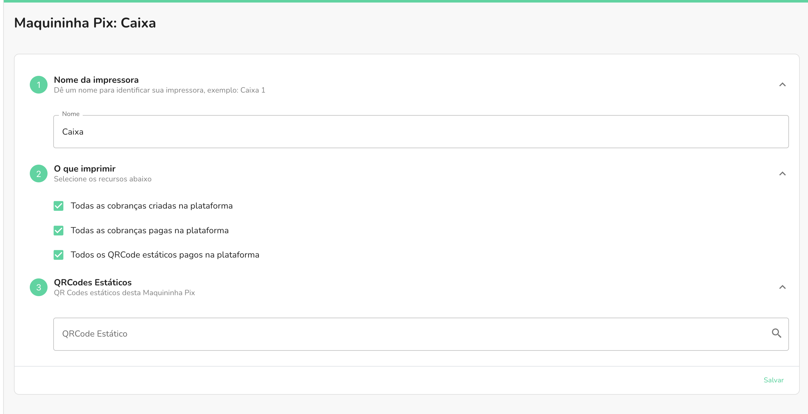

Com a Maquininha, trazemos a possibilidade de fazer a impressão tanto dos QR codes das
cobranças, quanto do recibo de pagamento delas.

Habilitando os filtros de **Todas as cobranças criadas na plataforma** e 
**Todas as cobranças pagas na plataforma**, habilitando ambos os filtros na sua integração,
sua Maquininha Pix automaticamente fará a impressão dos eventos conforme o nome descrito no filtro.

Toda cobrança criada a partir da plataforma, será automaticamente impresso pela Maquininha Pix, quando
habilitado o filtro de cobranças criadas. E todo pagamento dessas respectivas cobranças, será automaticamente
impresso quando o filtro de cobrança paga estiver habilitado.
