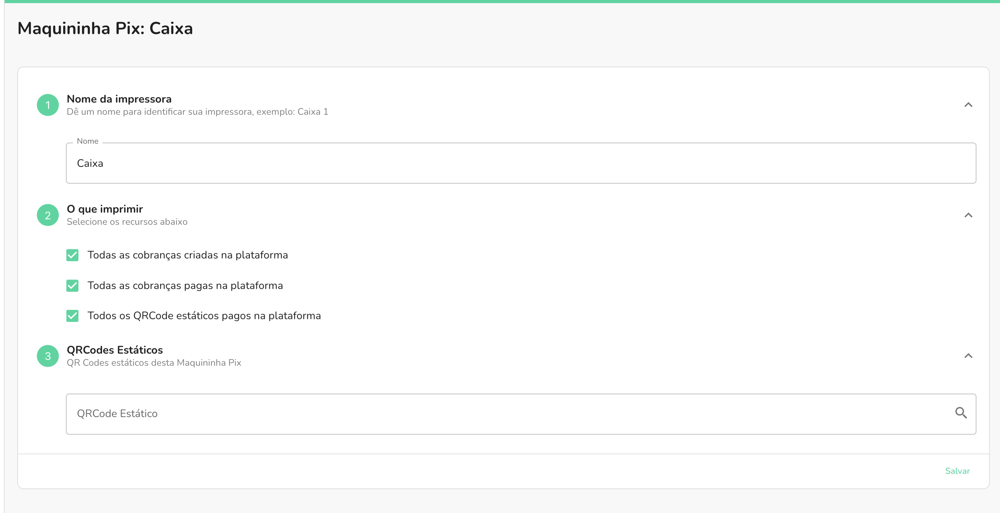

Com a Maquininha Pix, trazemos a possibilidade de você imprimir fisicamente os recibos
de pagamento de um ou mais QR codes estáticos.

Você tem duas possíveis maneiras de estar imprimindo os recibos de pagamento de um QR code estático, você pode tanto imprimir todos os pagamentos relacionados ao QR code ou filtrar um QR code estático em específico.

Caso deseja imprimir o recibo do pagamento de todos os QR code estáticos, basta selecionar a opção de **"Todos os QRCode estáticos pagos na plataforma"**.

## Filtrando os QR codes estáticos

Caso deseja filtrar a impressão dos recibos de pagamento de acordo com um QR code estático em específico,
a etapa de número 3 do formulário te dá essa possibilidade.

Clicando no campo de QR codes estáticos, abrirá uma lista para que possa selecionar quais QR codes estáticos
você deseja filtrar os eventos de pagamento.

:::info

Lembrando que é necessário desabilitar o filtro de **"Todos os QRCode estáticos pagos na plataforma"** para não haver nenhum conflito.

:::
