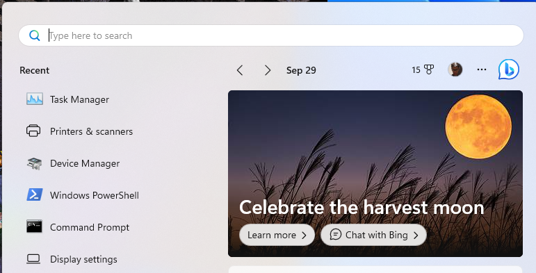
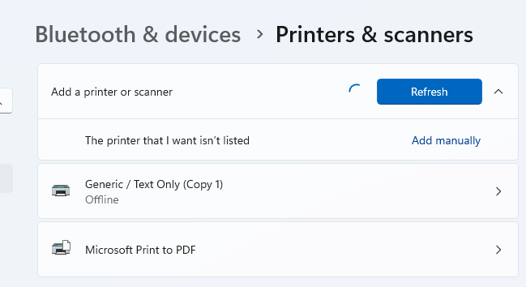
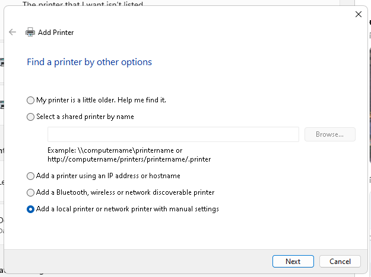
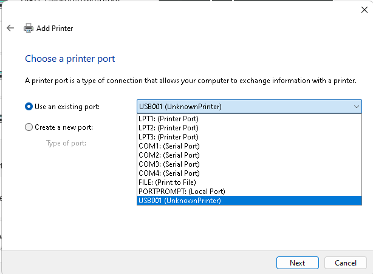
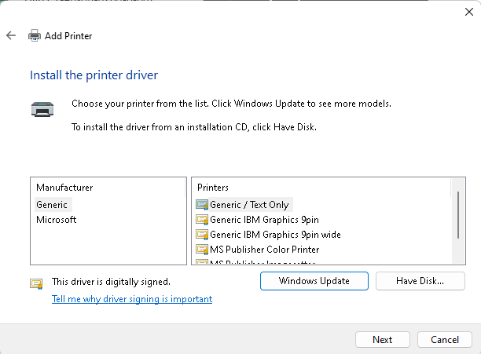
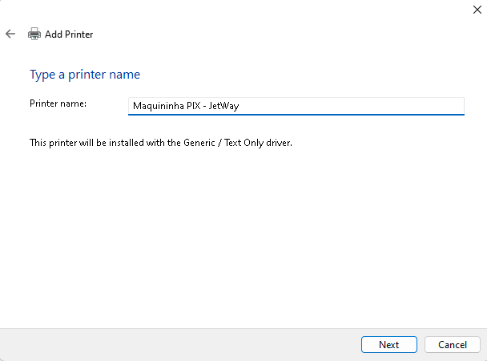
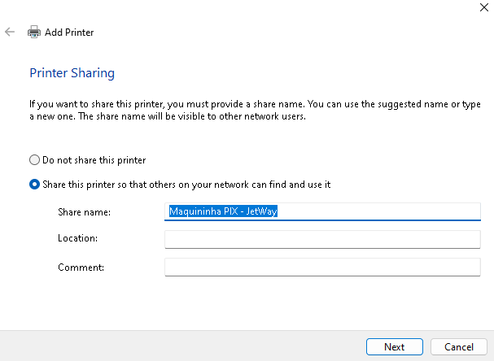
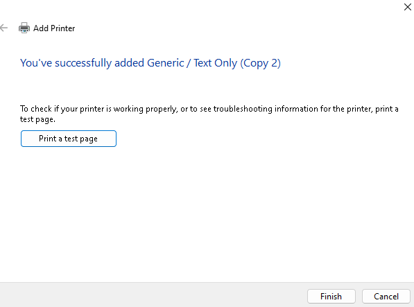

## Configurando sua maquininha no Windows

Para configurar sua maquininha junto com o nosso aplicativo recomendados que você siga os passos abaixo:

### 1. Acesse sua barra Windows e digite `Impressoras e Scanners`

Feito isso clique em adicionar uma impressora ou scanner local

### 2. Adicione sua impressora clicando em `Add manually`

### 3. Selecione a opção `Add a local printer`

### 4. Selecione a opção `Use an existing port` e selecione a porta usb de sua maquininha térmica

### 5. Utilize os drivers genéricos da Microsoft

### 6. Dê um nome para sua impressora e clique em `Next`

### 7. Clique em `Next na parte de configuração de compartilhamento`

### 8. Clique em `Print a test page` para testar se sua impressora está funcionando

### 9. Pronto! Sua impressora está configurada e pronta para ser usada
