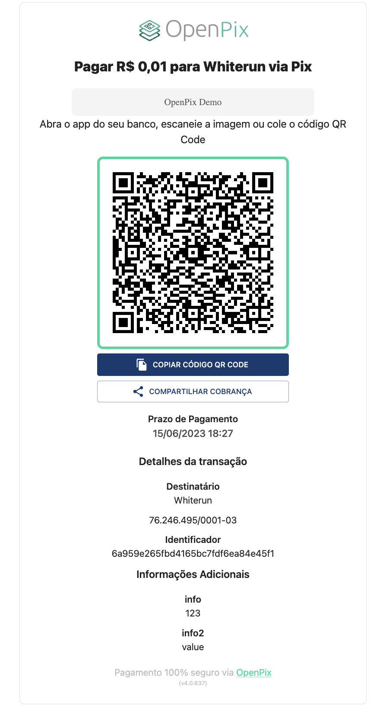

## Como renderizar o Plugin sem o modal?

Caso você deseja renderizar o nosso plugin diretamente numa div, sem precisar de um modal para isso, você pode
utilizar o seguinte código:

```jsx
window.$openpix.push([
  'charge',
  {
    modal: false,
    // restante dos parâmetros relacionados ao pix
    // ...
  },
]);
```

O argumento `wrapper` é um _booleano_ que vai ditar se é necessário renderizar o plugin dentro de um modal ou não.

## Como defino em qual elemento o plugin será renderizado?

Por padrão, o plugin é renderizado dentro do elemento que contenha o id `#openpix`.

Caso tenha a necessidade de renderizar o plugin numa div com um atributo distinto, nós aceitamos um
query param `node` que pode ser passado na URL que carrega o plugin.

Exemplo:

```html
<script src="https://plugin.openpix.com.br/v1/openpix.js?node=#other-identifier" allow="clipboard-read; clipboard-write"></script>
```

Nesse caso, o plugin será carregado assumindo o elemento que contenha o id `#other-identifier`.

## Exemplo do plugin renderizado sem modal


