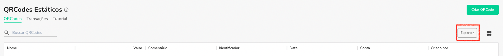

Você pode exportar a lista de QRCodes Estáticos dentro da plataforma para um excel. Siga os passos abaixo:

1. Acesse a rota https://app.openpix.com/home/qrcodes/tab/list
2. Clique em exportar no lado direito

3. A plataforma irá processar seu export e você será avisado quando o mesmo estiver pronto.
4. Veja como acessar sua exportação [aqui](/docs/export/export-intro)