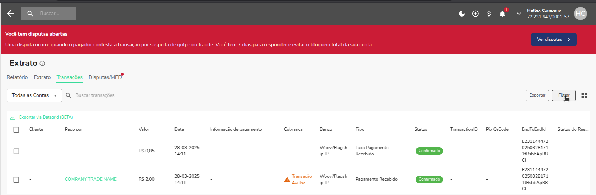

- [O que é recibo?](./recibo.md)
- [Começando com a integração via API](../apis/start-api-integration.md)

Documentação técnica da estrutura do endpoint de recibo:
https://developers.openpix.com.br/api#tag/receipt/paths/~1api~1v1~1receipt~1%7BEndToEndId%7D/get

Modelo de requisição:  
https://api.openpix.com.br/api/v1/receipt/:receiptType/:endToEndId

Exemplo de uso:  
https://api.openpix.com.br/api/v1/receipt/pix-in/E2202312345678901234567890123456

### Como obter um endToEndId via dashboard

Para obter um endToEndId do tipo pix-in, vá ao dashboard, em "Extrato" localize a aba transações e clique nela

Na lateral esquerda, localize o botão "Filtro", filtre pelo tipo "Recebimento" e aplique o filtro  

Depois, você pode copiar seu endToEndId e adicioná-lo à URL da requisição da API, utilizando o tipo de comprovante como sendo pix-in  

Os mesmos passos podem ser utilizados para obter endToEndId de outros tipos, como pix-out e pix-refund.  
Veja mais sobre tipos na seção de [Explicando Tipos](#explicando-tipos) abaixo.

### Como obter um recibo com o endToEndId?

1) Baixe e instale um cliente HTTP, como Postman, Bruno ou Insomnia.
> Neste guia, estarei utilizando o Postman como cliente HTTP.
2) Crie uma nova requisição e adicione a URL de exemplo no campo onde há um espaço vazio ao lado da palavra GET.  
   
> URL de exemplo: https://api.openpix.com.br/api/v1/receipt/:receiptType/:endToEndId
3) Substitua onde está `:receiptType` pelo tipo de recibo que você está querendo buscar (pix-in, pix-out ou pix-refund).
4) Substitua onde está `:endToEndId` pelo endToEndId dos seus recebimentos, pagamentos ou reembolsos.
5) Feito isso, você terá uma URL semelhante ao exemplo abaixo:
> https://api.openpix.com.br/api/v1/receipt/pix-in/E2202312345678901234567890123456
6) Agora precisamos configurar nosso appID para autenticação via API. Para isso, clique na aba "Headers" e crie novos campos de chave e valor. Defina a chave com o valor "Authorization" e, no valor dessa chave, coloque seu appID.  
   
7) Com a configuração do appID de autorização feita, podemos realizar uma chamada à API clicando no botão azul "Send" no Postman.

> Caso ainda não tenha um appID do tipo API, recomendamos fortemente que você visite a nossa documentação de [primeiros passos com API](../apis/api-getting-started.md).

### Explicando tipos:

**Pix In** é equivalente ao filtro de "Recebimentos" no nosso dashboard.  
O tipo `pix-in` deve ser utilizado quando você recebe um pagamento em sua conta, como por exemplo quando você gera uma cobrança e ela é paga por alguém. Você recebe um pagamento (transação pix-in, entrada de Pix).

**Pix Out** é equivalente ao filtro de "Pagamentos" no nosso dashboard.  
O tipo `pix-out` deve ser utilizado quando você faz um pagamento para uma chave Pix ou paga uma cobrança, como por exemplo quando alguém gera uma cobrança e você a paga. Um saque é realizado da sua conta para outra, por isso chamamos de pix-out (saída de Pix).

**Pix Refund** é equivalente ao filtro de "Reembolso" no nosso dashboard.  
Para o tipo `pix-refund`, temos duas variantes chamadas de "Pix Refund Sent" e "Pix Refund Received". Ele deve ser utilizado quando é realizado um reembolso de algum pagamento que você recebeu ou pagou.
- "Pix Refund Sent" é quando você efetua um reembolso para alguém.
- "Pix Refund Received" é quando você recebe um reembolso.

