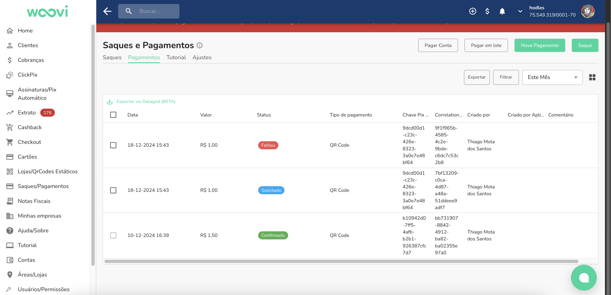
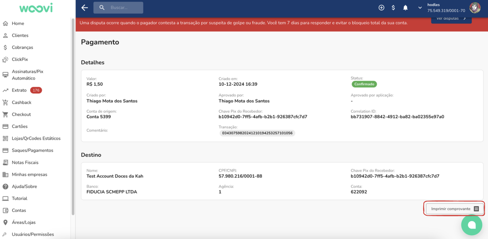
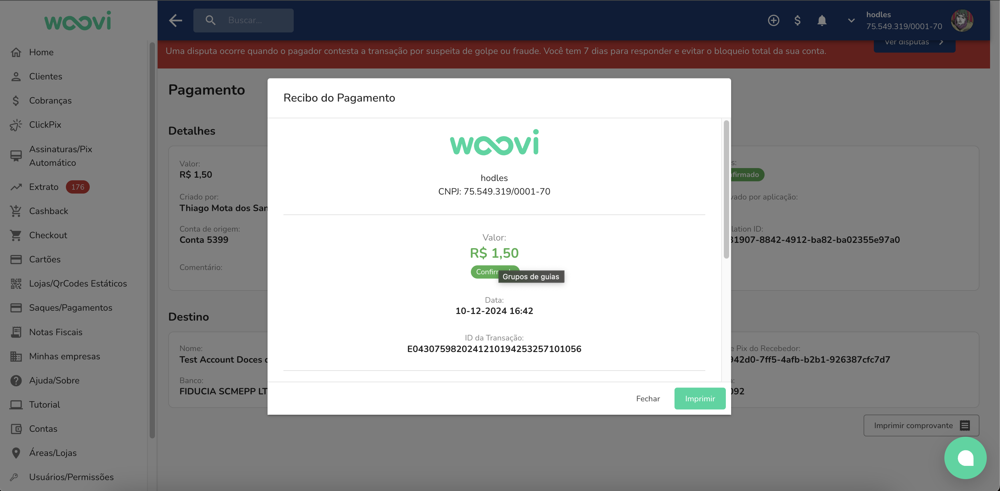
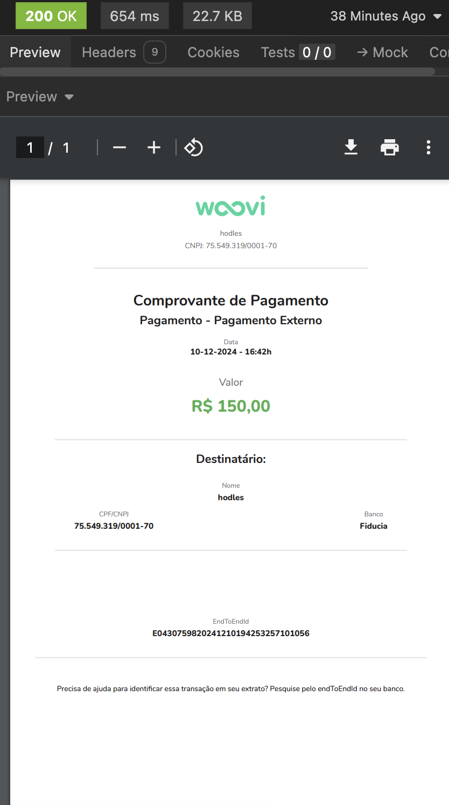

Ao fazer um pagamento, você consegue visualizar o recibo do mesmo. Para comprovar que essa operação foi de fato feita. 

## Como fazer visualizar um recibo?

Entre na plataforma e acesse o menu de Saques/Pagamentos.

 

Selecione um pagamento e clique em *Imprimir comprovante*

Visualize o recebido

## Como receber esse recibo via API?

Acesse a documentação da API [aqui](https://developers.openpix.com.br/api/#tag/receipt)

Caso n saiba criar uma API, acesse a documentacao de primeiros passos [aqui](https://developers.openpix.com.br/docs/apis/getting-started-api)

O endpoint que você precisa usar é um GET (/api/v1/receipt/:EndToEndId)

O EndToEndId é o ID do pagamento, você consegue visualizar essa informação na plataforma

Resposta da API em caso de sucesso:

