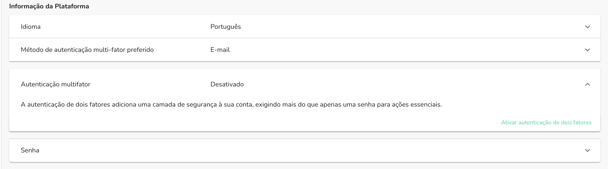
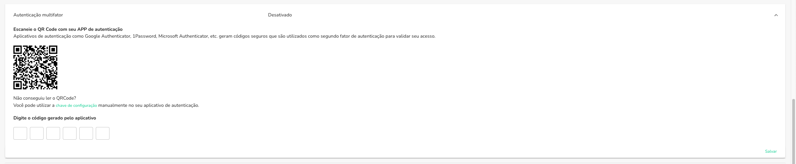
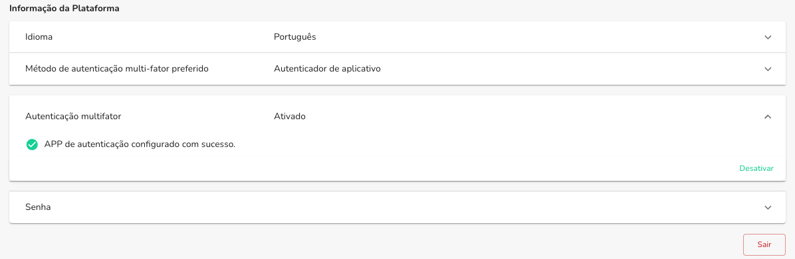

A autenticação multi-fator (MFA) é uma camada adicional de segurança que requer
mais de uma forma de autenticação para verificar a identidade do usuário. Isso pode ser
feito através de um aplicativo de autenticação, como o Google Authenticator, Microsoft Authenticator,
Authy, entre outros.

## Ativando a autenticação multi-fator

Para ativar a autenticação multi-fator, siga os passos abaixo:

Acesse a [página de configurações](https://app.openpix.com.br/home/me/account/edit) da sua conta.

Na seção "Informação da Plataforma", clique em "Autenticação multifator"

Clique no botão "Ativar autenticação de dois fatores"

Escaneie o QR Code com o aplicativo de autenticação, caso não conseguir, você pode inserir o código manualmente.

:::info

Caso não seja possivel escanear o QR code a partir do seu dispositivo, você pode estar
inserindo manualmente o código conforme o informado quando você clica em `"chave de configuração"`.

:::

Após escanear o QR Code, insira o código gerado pelo aplicativo de autenticação no campo abaixo de "Digite o código de verificação".

Clique no botão "Salvar"

Você configurou a autenticação multi-fator com sucesso!

Com isso, todas as ações que exigem uma autenticação na sua conta, alteração de senha,
saques, pagamentos externos, entre outros, irão exigir a autenticação multi-fator para serem realizadas.

## Trocando o dispositivo de autenticação multi-fator

Caso você tenha trocado de dispositivo ou perdido o acesso ao aplicativo de autenticação,
você deverá entrar em contato com o nosso time de suporte que irá realizar todo o processo
para auxiliar na troca do dispositivo.

## Desativando a autenticação multi-fator

Caso você queira desativar a autenticação multi-fator, siga os passos abaixo:

1. Acesse a [página de configurações](https://app.openpix.com.br/home/me/account/edit) da sua conta.
2. Na seção "Informação da Plataforma", clique em "Autenticação multifator"
3. Clique no botão "Desativar"
4. Você precisará confirmar a desativação da autenticação multi-fator inserindo o código gerado pelo aplicativo de autenticação no campo abaixo de "Digite o código de verificação".
5. Após confirmar, a autenticação multi-fator será desativada com sucesso.

Lembre-se que a autenticação multi-fator é uma camada adicional de segurança para a sua conta,
desativá-la pode deixar a sua conta mais vulnerável a ataques. Caso você tenha desativado a
autenticação multi-fator, recomendamos que você ative novamente o mais rápido possível.

## Como selecionar o método de autenticação preferido?

Caso você tenha mais de um método de autenticação configurado, você pode selecionar o método
preferido para autenticação multi-fator. Para isso, siga os passos abaixo:

1. Acesse a [página de configurações](https://app.openpix.com.br/home/me/account/edit) da sua conta.
2. Na seção "Informação da Plataforma", clique em "Método de autenticação multi-fator preferido"
3. Selecione o método de autenticação que você deseja utilizar como preferido.
4. Clique no botão "Salvar"
5. Você configurou o método de autenticação multi-fator preferido com sucesso!

## Recomendações de Apps de Autenticação

Existem diversos aplicativos de autenticação disponíveis no mercado, abaixo listamos alguns
dos mais utilizados:

- Google Authenticator
- Microsoft Authenticator
- Authy
- LastPass Authenticator
- 1Password

Caso você tenha dúvidas sobre qual aplicativo utilizar, recomendamos que você entre em contato
com o suporte do aplicativo de autenticação para obter mais informações.
