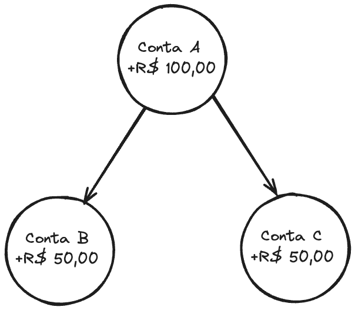
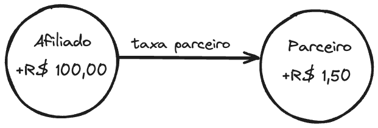
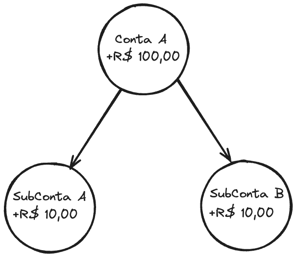

:::info
Para a utilização dessa funcionalidade é necessário possuir uma conta na OpenPix e a funcionalidade Split, entre em contato com nosso time de suporte para habilitar essa funcionalidade.
:::

## Definição de split

O split é uma funcionalidade que permite que o recebimento de uma cobrança seja dividido entre diversas contas.

## Como funciona?

A OpenPix possui diversas funcionalidades de split que permite que o recebimento de uma cobrança seja dividido entre algumas chaves pix via `API`, via plataforma e via `plugin.js`

## Tipos de split

Temos 2 tipos de split, e esses dois tipos de split tem casos de uso diferentes, por isso é necessário antes de utilizar o split entender qual tipo de split utilizar.

### Split de parceiro e afiliado (SPLIT_PARTNER)

O split de parceiro e afiliado é uma funcionalidade que permite que o recebimento de uma cobrança seja dividido entre a conta do parceiro e a conta do afiliado.

Ou seja, parte do valor da cobrança vai para a conta do parceiro e parte do valor da cobrança vai para a conta do afiliado, sendo possível configurar uma porcentagem ou valor fixo do parceiro diretamente pela plataforma para todas as cobranças.

#### Quando utilizar (SPLIT_PARTNER)

O sistema de parceiros permite a empresas registrar outras empresas como afiliados e gerenciar alguns aspectos do seu funcionamento através das API's e plataforma OpenPix.

Cada afiliado passa pelo processo de abertura de contas na plataforma.

Cada afiliado possui conta virtual na plataforma registrada no CNPJ de sua empresa independente do parceiro.

Cada afiliado recebe valores de cobranças diretamente via pix em sua conta virtual registrada na plataforma.

O parceiro não recebe diretamente valores em sua conta, somente taxa do parceiro perante o uso da feature de `SPLIT_PARTNER`.

Esta feature é indicada para quem quer ter uma relação mais definida entre parceiro e afiliados e pretende envolver parceiros no cadastro completo de uma conta virtual

requisitando assim dados de registro de empresa e sócios como qualquer outra abertura de contas, não recebendo diretamente em suas contas valores relativos a pagamento feitos por afiliados, somente valores relativos a taxa de parceiros.

### Split de sub-contas (SPLIT_SUB_ACCOUNT)

Sub contas são contas virtuais representadas por uma chave pix que podem transacionar virtualmente valores através do sistema de split de pagamentos. Esses valores podem ser convertidos em transações reais através do saque para a chave pix registrada para a subconta.

Ou seja, parte do valor da cobrança vai para uma chave pix e parte do valor da cobrança vai para outra chave pix, sendo possível definir na hora da criação da cobrança o valor que vai para cada chave pix.

#### Quando utilizar (SPLIT_SUB_ACCOUNT)

O sistema de subcontas permite registrar transações de split em uma subconta a partir de cobranças feitas para uma conta principal.

Subcontas não são contas bancárias reais e somente transacionam valores virtuais permitindo assim a eliminação de etapas burocráticas na abertura da mesma.

Cada subconta só precisa de uma chave pix única para ser aberta, de qualquer tipo, CPF, CNPJ, email, telefone, etc.

Uma empresa pode ter qualquer número de subcontas.

Uma empresa pode a qualquer momento realizar um saque para a chave pix registrada na subconta, tanto via integração de API ou diretamente pela plataforma.

O uso da subconta permite a criação de fluxos menos burocráticos e mais livres dentro da plataforma, os valores sacados só serão debitados da conta principal no momento do saque garantindo total controle ao administrador da empresa dona destas subcontas.
