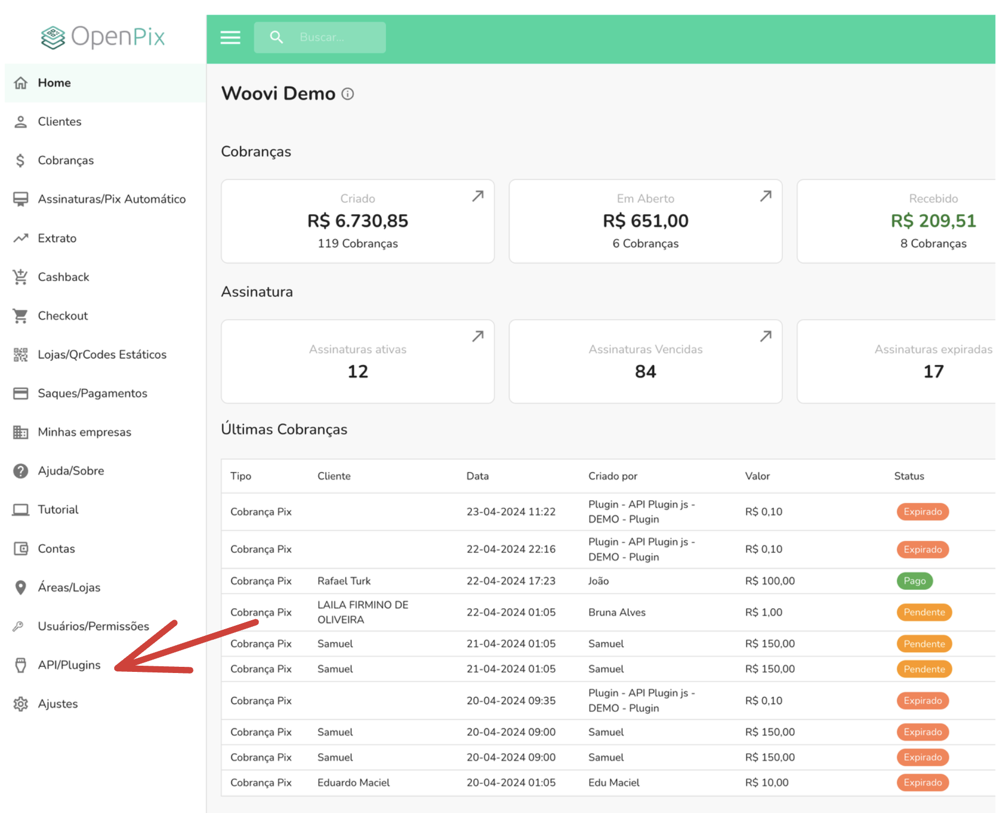

import Tabs from '@theme/Tabs';
import TabItem from '@theme/TabItem';

:::info
Para a utilização desta funcionalidade é necessário possuir a funcionalidade Subconta
:::

Existem algumas situações em que você precisa destinar todo o montante de uma aplicação para uma subconta. Em vez de precisar fazer vários splits ou especificar a subconta de destino nas requisições, você pode criar uma aplicação que fará isso automaticamente para você.

Para isso, basta seguir estes passos:

1. Acesse a seção API / Plugins.

2. Em seguida, clique em Nova API/Plugin.

3. Preencha com o nome que você deseja identificar seu integração.

4. Selecione a subconta que você deseja atrelar ao seu integração.

Selecione a subconta que você deseja que vincular com essa integração.

Por último, salve para efetuar a criação da integração.

Prontinho! Agora você tem um integração vinculada à uma subconta.
