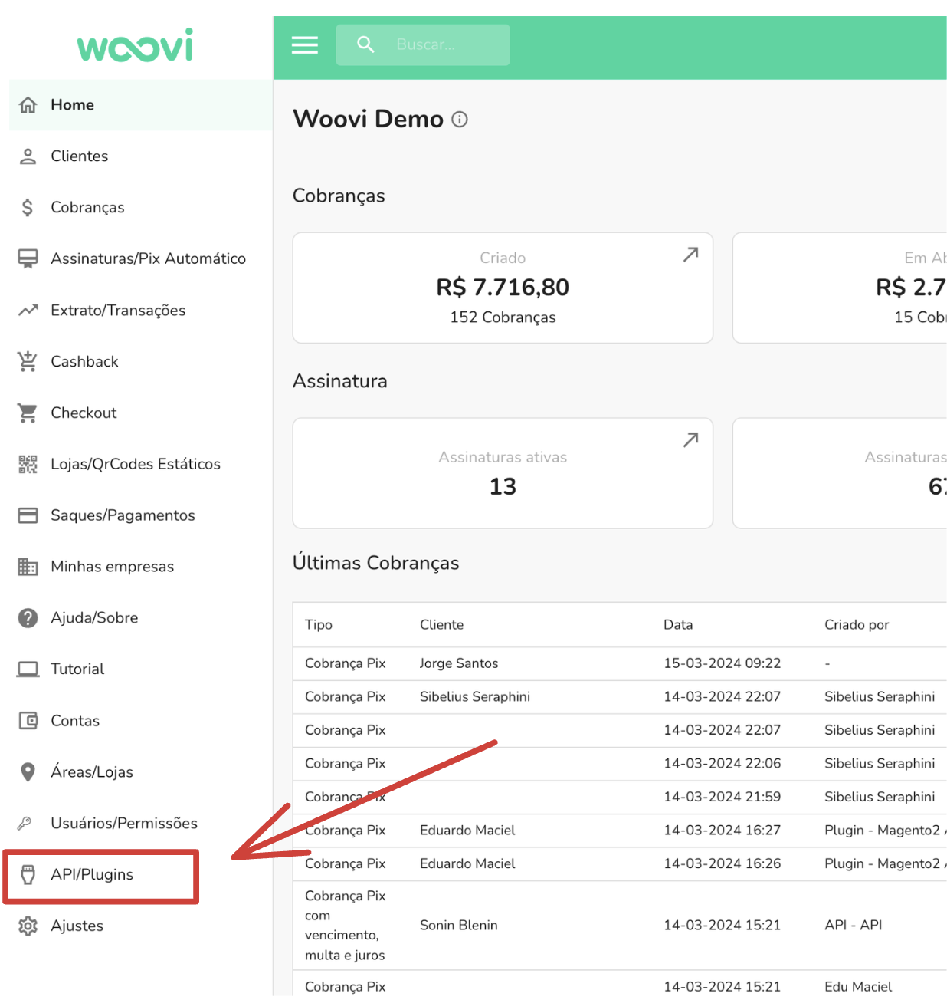
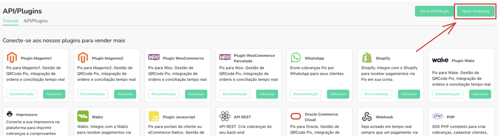
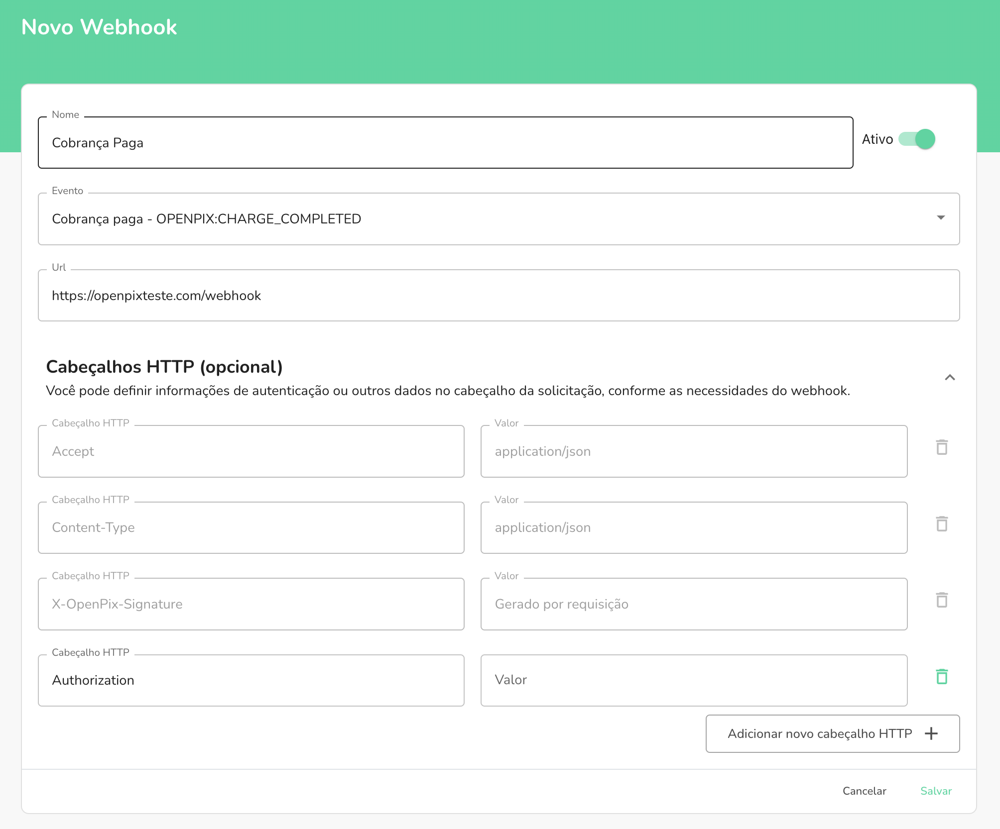

:::info
Para a utilização desta funcionalidade é necessário possuir a funcionalidade Subconta
:::

A forma mais recomendada para reconhecer uma subconta de uma cobrança após o pagamento em tempo real é utilizando o nosso Webhook de cobrança paga. Nele é retornado todas as informações da cobrança, inclusive a subconta, caso a cobrança esteja atrelada à uma. Segue o exemplo do payload retornado pelo Webhook de uma cobrança atrelada à uma subconta:

```json
{
  "event": "OPENPIX:CHARGE_COMPLETED",
  "charge": {
    "customer": {
      "name": "CONTA DE PAGAMENTO DE PIX",
      "taxID": {
        "taxID": "74866698000169",
        "type": "BR:CNPJ"
      },
      "correlationID": "<correlationID>"
    },
    "value": 1600,
    "comment": "from-script-api",
    "identifier": "a74f60ba44e54c67b2cb74243971a674",
    "correlationID": "<correlationID>",
    "paymentLinkID": "<paymentLinkID>",
    "transactionID": "a74f60ba44e54c67b2cb74243971a674",
    "status": "COMPLETED",
    "additionalInfo": [],
    "discount": 0,
    "valueWithDiscount": 1600,
    "expiresDate": "2024-03-16T18:19:44.426Z",
    "type": "DYNAMIC",
    "createdAt": "2024-03-15T18:19:50.296Z",
    "updatedAt": "2024-03-15T18:22:04.045Z",
    "paidAt": "2024-03-15T18:19:50.154Z",
    "payer": {
      "name": "CONTA DE PAGAMENTO DE PIX",
      "taxID": {
        "taxID": "74866698000169",
        "type": "BR:CNPJ"
      },
      "correlationID": "<correlationID>"
    },
    "brCode": "<brCode>",
    "subaccount": {
      "name": "mediatorpix@key.com",
      "pixKey": "mediatorpix@key.com"
    },
    "expiresIn": 86400,
    "pixKey": "<pixKey>",
    "paymentLinkUrl": "<paymentLinkUrl>",
    "qrCodeImage": "<qrCodeImage>",
    "globalID": "<globalID>"
  },
  "pix": {
    "customer": {
      "name": "CONTA DE PAGAMENTO DE PIX",
      "taxID": {
        "taxID": "74866698000169",
        "type": "BR:CNPJ"
      },
      "correlationID": "<correlationID>"
    },
    "payer": {
      "name": "CONTA DE PAGAMENTO DE PIX",
      "taxID": {
        "taxID": "74866698000169",
        "type": "BR:CNPJ"
      },
      "correlationID": "<correlationID>"
    },
    "charge": {
      "customer": {
        "name": "CONTA DE PAGAMENTO DE PIX",
        "taxID": {
          "taxID": "74866698000169",
          "type": "BR:CNPJ"
        },
        "correlationID": "<correlationID>"
      },
      "value": 1600,
      "comment": "from-script-api",
      "identifier": "a74f60ba44e54c67b2cb74243971a674",
      "correlationID": "<correlationID>",
      "paymentLinkID": "<paymentLinkID>",
      "transactionID": "a74f60ba44e54c67b2cb74243971a674",
      "status": "COMPLETED",
      "additionalInfo": [],
      "fee": 50,
      "discount": 0,
      "valueWithDiscount": 1600,
      "expiresDate": "2024-03-16T18:19:44.426Z",
      "type": "DYNAMIC",
      "createdAt": "2024-03-15T18:19:50.296Z",
      "updatedAt": "2024-03-15T18:22:04.045Z",
      "paidAt": "2024-03-15T18:19:50.154Z",
      "payer": {
        "name": "CONTA DE PAGAMENTO DE PIX",
        "taxID": {
          "taxID": "74866698000169",
          "type": "BR:CNPJ"
        },
        "correlationID": "<correlationID>"
      },
      "brCode": "<brCode>",
      "subaccount": {
        "name": "mediatorpix@key.com",
        "pixKey": "mediatorpix@key.com"
      },
      "expiresIn": 86400,
      "pixKey": "<pixKey>",
      "paymentLinkUrl": "<paymentLinkUrl>",
      "qrCodeImage": "<qrCodeImage>",
      "globalID": "<globalID>"
    },
    "value": 1600,
    "time": "2024-03-15T18:19:50.154Z",
    "endToEndId": "E231144472024031518218Xb59c4mq1x",
    "transactionID": "a74f60ba44e54c67b2cb74243971a674",
    "type": "PAYMENT",
    "createdAt": "2024-03-15T18:22:03.843Z",
    "globalID": "<globalID>"
  },
  "company": {
    "id": "<companyID>",
    "name": "master",
    "taxID": "<taxID>"
  },
  "account": {
    "clientId": "<clientId>"
  }
}
```

## Exemplo

Vamos imaginar um caso que queremos identificar a subconta pertencente a uma cobrança paga, para realizar uma transferência entre subcontas.

Para isso, vamos precisar está criando um Webhook com o evento `Cobrança paga - OPENPIX:CHARGE_COMPLETED`. Para criar esse Webhook, bastar você entrar na nossa plataforma, e acessar a aba `API/Plugins` via sidebar menu.



E logo em seguida, clicar no botão `Novo Webhook`.



Nesse caso, eu vou está criando o Webhook com as seguintes configurações:



- Nome: `Webhook de Cobrança Paga` (Você pode está escolhendo o nome que quiser)
- Evento: `Cobrança paga - OPENPIX:CHARGE_COMPLETED` (Esse evento é disparado quando uma cobrança é paga)
- URL: `https://openpixteste.com/webhook` (Essa é a URL do meu serviço que estará recebendo as chamadas do Webhook)

Aqui está um exemplo de um servidor HTTP em Node.js utilizando Express, na qual possui apenas a rota que irá receber as chamadas do Webhook.

```js
const express = require('express');
const node-fetch = require('node-fetch');

const app = express();

app.use(express.json());

// Endpoint que estará recebendo as chamadas do Webhook da OpenPix.
app.post('/webhook', (request, response) => {
  const webhookResponse = request.body;

  // Esse `if` garante que transferência só será feita
  // se a cobrança tiver uma subconta atrelada à ela.
  if (webhookResponse.charge.subaccount) {
    // Valor da transferência, sempre 30% do valor da cobrança.
    const transferValue = webhookResponse.charge.value * 0.3;
    // Chave Pix da subconta que recebeu o pagamento da cobrança
    const fromPixKey = webhookResponse.charge.subaccount.pixKey;

    // Requsição que fará a transferência do valor entre subcontas.
    const response = await fetch(`https://api.openpix.com.br/api/v1/subaccount/transfer`, {
      method: 'POST',
      "headers": {
        "Content-Type": "application/json",
        "Authorization": "REPLACE_WITH_YOUR_APPID"
      },
      body: JSON.stringify({
        value: transferValue,
        fromPixKey,
        fromPixKeyType: 'EMAIL',
        // Chave Pix da subconta que receberá o valor da transferência.
        toPixKey: 'mediator@pixkey.com',
        toPixKeyType: 'EMAIL',
      });
    });

    const status = await response.status();

    if (status === 200) {
      return response.status(200).json({ success: 'Transfer done!' });
    }

    return response.status(400).json({ error: 'Failed to make the transfer' });
  }

  return response.status(200);
});

app.listen(3000, () => {
  console.log('Server running on port 3000');
});
```

Basicamente, quando o payload enviado pelo Webhook tiver o campo `charge.subaccount`, ele irá fazer uma nova requisição para OpenPix realizando uma transferência de 30% do valor da cobrança para a subconta vinculada a chave Pix `mediator@pixkey.com`. Caso o payload não contenha esse campo, a rota apenas retorna o código de status 200.

Essa é uma forma de reconhecer uma subconta após o pagamento de uma cobrança, e executar uma ação através disso.
