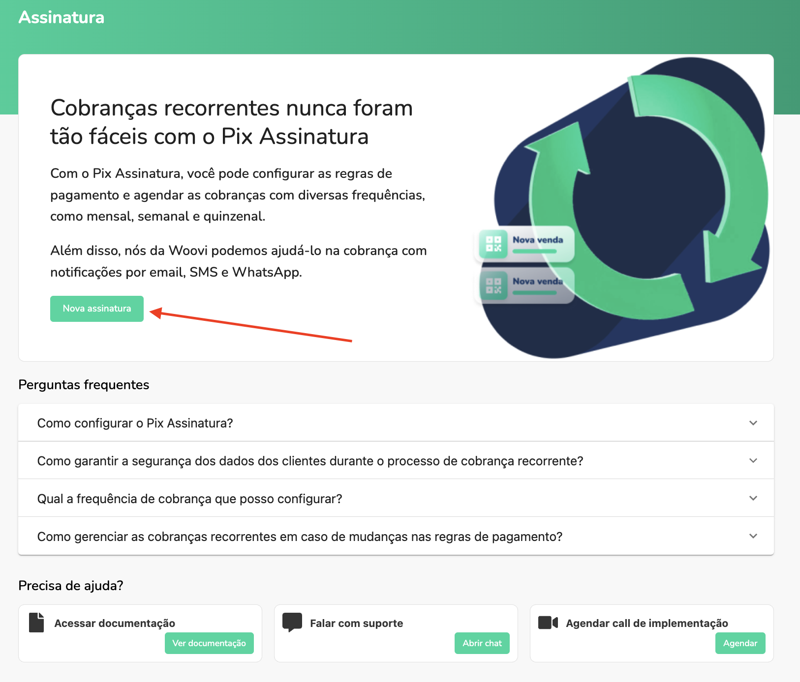
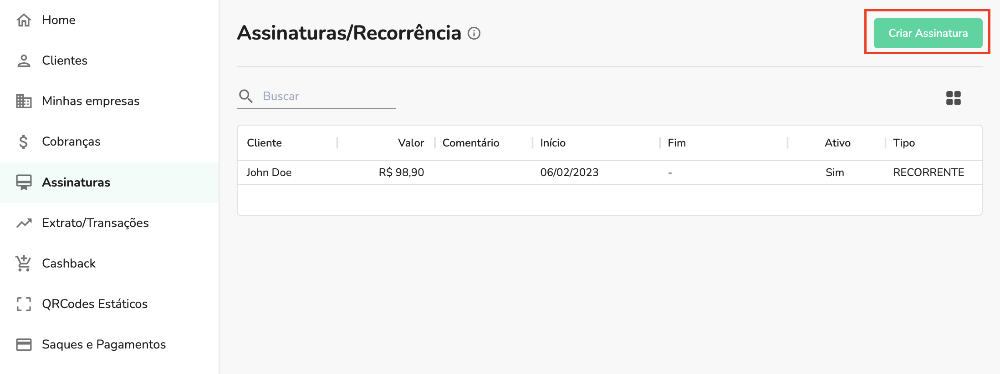
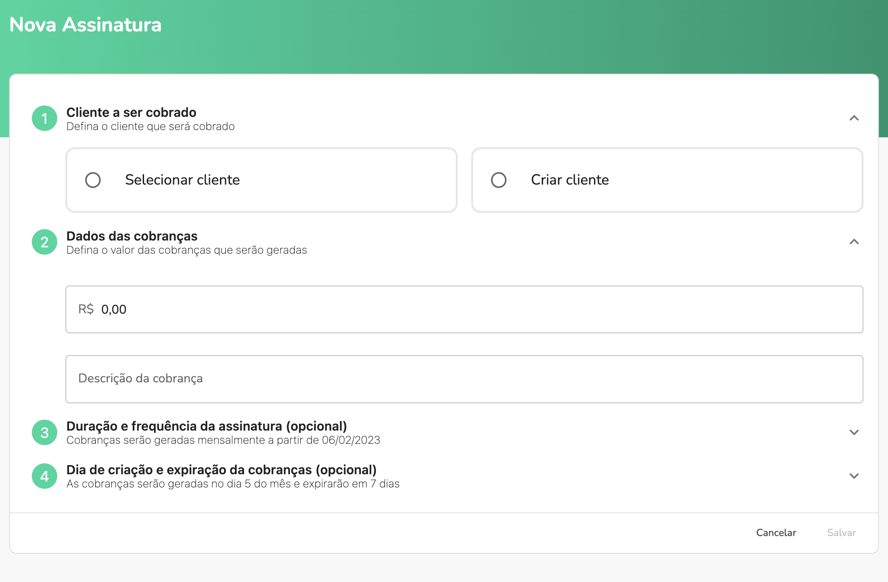
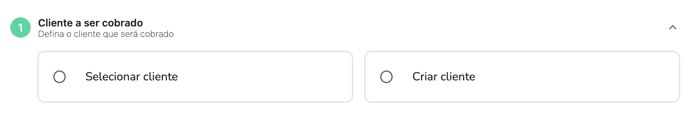
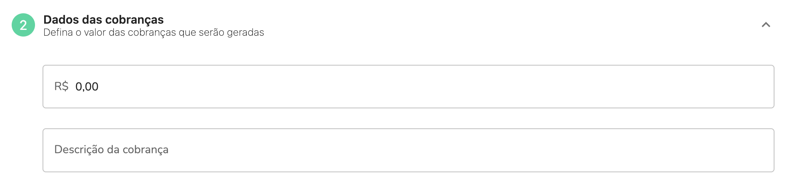
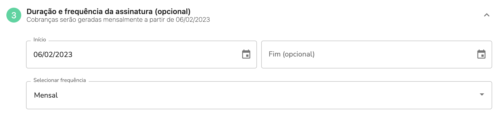
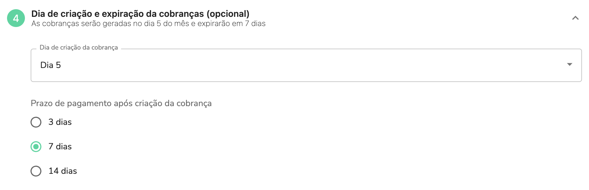
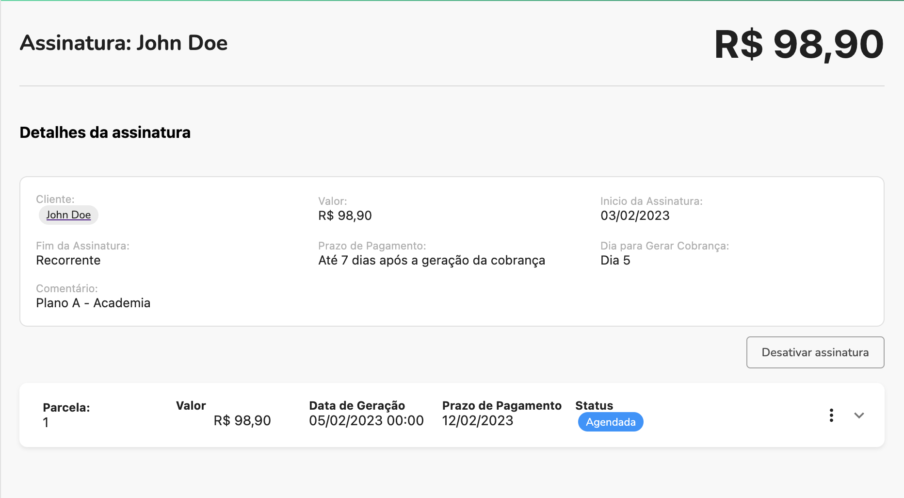

Nessa documentação explicaremos, passo a passo, como criar uma Assinatura.

## Criando sua primeira assinatura

Para criar sua primeira Assinatura siga estes passos:

1. Acesse nossa plataforma [https://app.openpix.com/login](https://app.openpix.com/login)
2. Vá em **Assinaturas** na barra lateral
3. Você encontrará nosso o tutorial, clique no botão **Nova Assinatura** para abrir o formulário e criar sua primeira Assinatura

## Criando novas assinaturas

Caso já tenha criado uma Assinatura antes, aparecerá a listagem de assinaturas.

Para criar uma nova clique no botão **Criar Assinatura**.

## Formulário

Após isso você encontrará nosso formulário para criação de Assinaturas.

Abaixo, explicaremos cada passo deste formulário e o que cada campo significa.

### Passo 1: Cliente a ser cobrado

Para criar uma Assinatura é **obrigatório** um cliente, você pode adicionar um:

- Escolhendo um cliente de sua base de clientes já existente
- Criando um novo cliente

### Passo 2: Dados das cobranças

Neste passo você irá configurar como as cobrança da Assinatura serão geradas:

| Campo                 | Descrição                                                   | Exemplo            |
| --------------------- | ----------------------------------------------------------- | ------------------ |
| Valor                 | Valor a ser cobrado                                         | **R$ 98,90**       |
| Comentário (opcional) | Comentário que aparecerá no QR Code no momento do pagamento | Plano A - Academia |

### Passo 3: Duração e frequência da Assinatura (opcional)

Neste passo você irá configurar a duração e frequência da Assinatura.

Uma Assinatura pode ou não ter uma data de fim.

- Se possuir: será agendada todas as parcelas até a data de fim e as cobranças serão geradas de acordo com a data.
- Se não possuir: será gerada uma cobrança e agendada a próxima de acordo, essas Assinaturas só terão fim se forem desativadas.

| Campo          | Padrão      | Descrição                    | Exemplo        |
| -------------- | ----------- | ---------------------------- | -------------- |
| Início         | _Dia atual_ | Data de inicio da Assinatura | **06/02/2023** |
| Fim (opcional) |             | Data de fim da Assinatura    | **25/12/2024** |
| Frequência     | Mensal      | Frequência da Assinatura     | **Mensal**     |

### Passo 4: Dia de criação e expiração da cobranças (opcional)

Neste passo você irá configurar o dia de criação e prazo de pagamento das cobranças.

| Campo              | Padrão | Descrição                                                      | Exemplo    |
| ------------------ | ------ | -------------------------------------------------------------- | ---------- |
| Dia de criação     | Dia 5  | Dia do mês em que as cobranças serão geradas                   | **Dia 20** |
| Prazo de pagamento | 7 dias | Prazo que o cliente terá para pagar após a geração da cobrança | **3 dias** |

### Passo 5: Salvar

Após finalizar todos os passos anteriores, é só clicar no botão **Salvar** e você será redirecionado para o detalhe da Assinatura:

