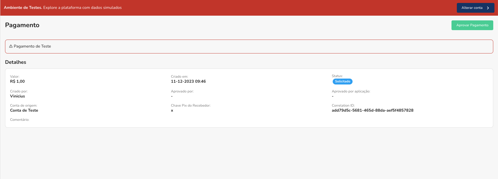

Pagar uma chave pix testar se o Webhook cadastrado está funcionando, alem de testar as funcionalidades de pagamento.

Para pagar uma chave pix usando a conta de testes, primeiro vá até o menu de `Saques/Pagamentos` e clique em `Novo Pagamento`, no canto superior direito da tela.

Você poderá preencher a chave pix que deseja simular um pagamento, o valor e o comentário do pagamento (opcional). Após isso clique em `Solicitar`.

O pagamento estará disponível para ser aprovado, você seria redirecionado para a tela de detalhes do pagamento, onde poderá aprovar o pagamento.

Todos os pagamentos feitos na conta de testes aparecerão um banner de aviso no topo da tela, indicando que o pagamento foi feito na conta de testes.

Por fim, você pode aprovar o pagamento clicando em `Aprovar Pagamento` no canto superior direito da tela e depois em `Aprovar`.

### Chaves Pix disponíveis para teste

Possuimos algumas chaves pix disponíveis para teste, para simular alguns casos de uso, essas chaves pix estão disponíveis para serem usadas em qualquer conta de teste.

| Chave Pix                   | Caso de uso                                                  |
| --------------------------- | ------------------------------------------------------------ |
| pix-key-not-found@woovi.com | Simular quando uma chave pix não esta cadastrada em um banco |
| bank-error@woovi.com        | Simular quando a instituição de destino esta fora do ar      |
