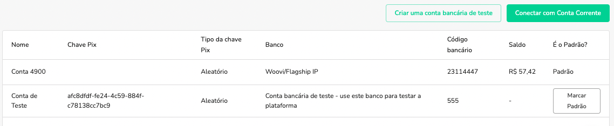

## Conta de Teste

Para gerar novas cobranças na OpenPix, você precisa criar sua conta virtual.

Para evitar custos ao testar a OpenPix, temos uma conta bancária especial para testes. Cada cobrança criada usando o teste da mesma não irá gerar custos em seu banco e você também não gastará nenhum dinheiro.

## Como criar uma Conta Bancária para testes

Clique em `Ajustes -> Pix -> Ir para Configurações avançadas`

Veja em [https://app.openpix.com/home/settings/company-bank-acccount/list](https://app.openpix.com/home/settings/company-bank-acccount/list)

Para adicionar uma conta de teste basta clicar no botão `Criar uma conta bancária de teste`

Marque esta Conta Bancária como sua conta bancária padrão, conforme abaixo:

Depois disso, você pode criar uma nova Cobrança e escanear o QRCode usando a câmera do seu celular

## Como promover seu ambiente de testes para produção

Para promover seu ambiente de testes para produção, você precisa ter sua conta virtual aprovada.

1. Acesse a [listagem de API's](https://app.openpix.com/home/applications/tab/list) e escolha qual você deseja promover para produção
2. Dentro dos detalhes da API, selecione a conta bancária atrelada desejada

## Dúvidas frequentes

  
Não Consigo Scanear o QRcode de teste

  

    
O QRCode não é um BRCode EMV válido, portanto você não consegue scanear em seu banco

     
  

  
Como pagar um QRCode de teste?

  

    
Para pagar um QRCode de teste você precisa acessar o detalhe da cobrança, e clicar em simular pagamento

     
  

