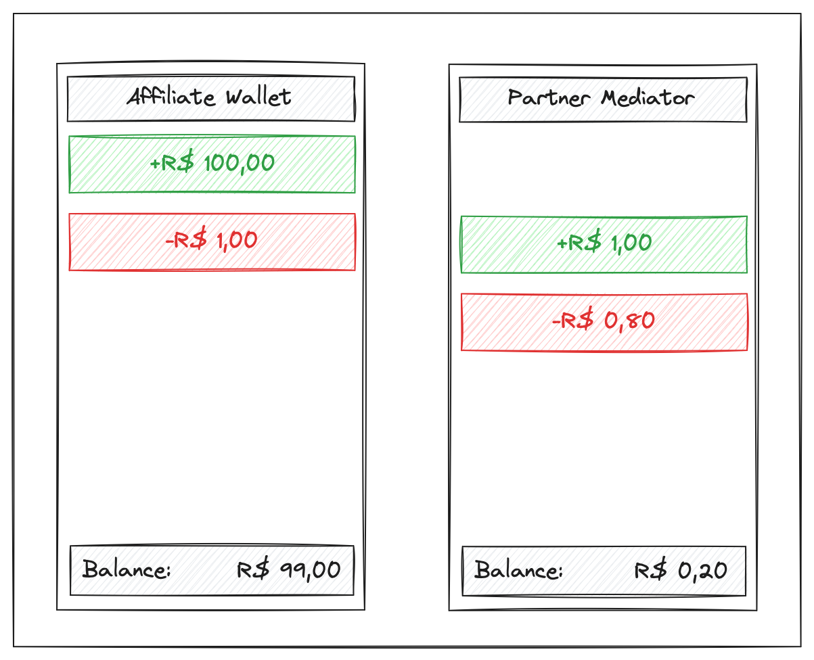

## Conta Mediator

A conta `Mediator` é responsável por receber todos os valores relacionados a receitas de tarifas, dentro do sistema de Wallets do Parceiro. Além de receber receitas, essa conta também é onde será debitado o valor das tarifas da plataforma.

### Exemplos

Nesse exemplo, uma Wallet de um affiliado recebe um valor de uma Cobrança, e logo em seguida realiza o pagamento de sua tarifa para a Mediator do parceiro, e então é realizada a cobrança da tarifa da plataforma dentro da Mediator.

