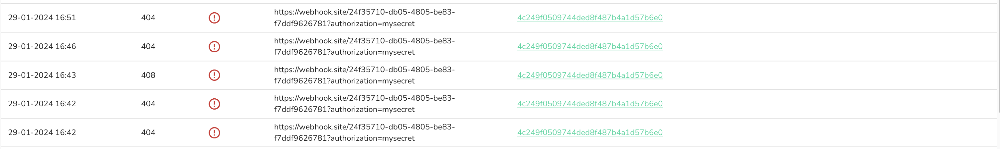

1. Acesse `API/Plugins` via sidebar menu.

2. Acesse a aba `API/Plugins`.

3. Acesse o detalhe do Webhook que você deseja verificar se está funcionando corretamente, no meu caso o Webhook que quero verificar possui o nome de `bot conversa`.

4. Já dentro do detalhe do Webhook, acesse a aba `Logs`.

Neste cenário, todas as requisições feitas pelo Webhook ao endpoint configurado retornaram o código de status 200, indicando sucesso (Saiba mais sobre códigos de status nesse [link](https://developer.mozilla.org/pt-BR/docs/Web/HTTP/Status)). No entanto, caso a chamada resulte em outros códigos de status, essas informações também serão registradas no log.

Por exemplo, se ocorreu uma chamada para o mesmo Webhook que resultou em um código 404 (Not Found), nosso serviço indicará que essa chamada não foi bem-sucedida, apresentando também o código de erro correspondente.

Outro ponto importante é que também salvamos o corpo da requisição (Request Body) enviado para o endpoint, assim como o corpo da resposta (Response Body) recebido. Para consultar essas informações, basta clicar no log correspondente, o que abrirá uma janela exibindo todos esses detalhes. Veja um exemplo:

