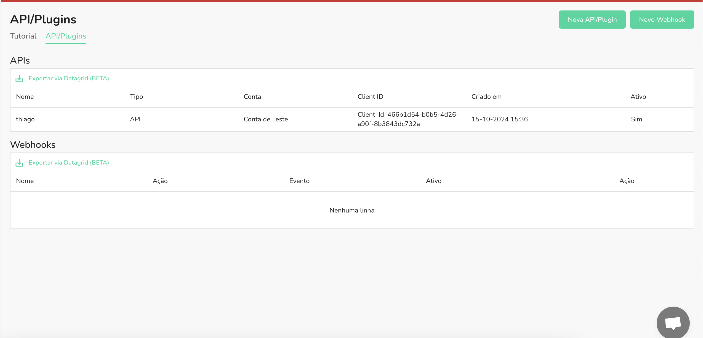

## Como vincular o webhook à API?

Além dos webhooks que são disparados ao realizar ações na plataforma, é possível vincular um webhook a uma API.

Primeiro, tenha uma api já configurada na plataforma.

Agora, crie um novo webhook.

Atualmente só é possível vincular um webhook a uma api nos eventos de charge. 

Clique em vincular a aplicação

Ao salvar, os eventos selecionados de cobranças serão enviados para o endereço do webhook com base nas ações da API.
