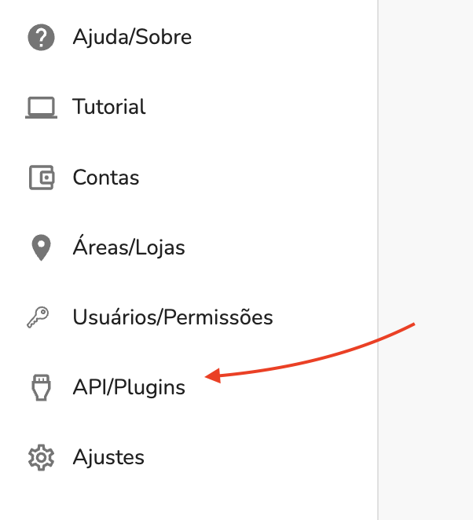
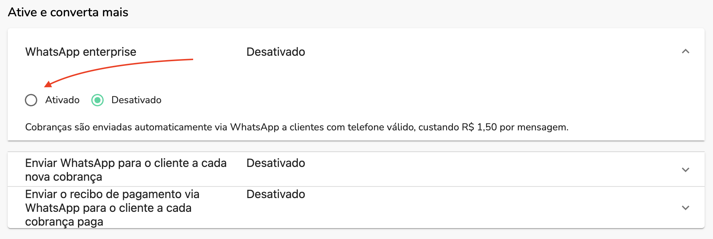

Para ativar o WhatsApp em sua empresa siga os passos abaixo:

## 1. Abra a seção de integrações

Acesse `Api/Plugins` via sidemenu

## 2. Abra o tutorial de WhatsApp

Clique na botão de **Adicionar** na integração do WhatsApp

## 3. Ative o WhatsApp

Clique em **Ativado** para ativar o WhatsApp

## 4. Configure quais notifiações enviar

Por padrão, ao ativar o WhatsApp, todas as notifiações de WhatsApp são ativadas, para saber mais sobre cada uma, leia os artigos abaixo:

- [Como enviar cobranças por WhatsApp](./whatsapp-how-to-send-charges.md)
- [Como enviar recibos por WhatsApp](./whatsapp-how-to-send-receipts.md)