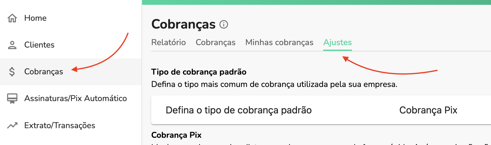

Para enviar recibos por WhatsApp siga os passos abaixo:

## 1. Ative o WhatsApp

Para ativar o WhatsApp, siga [esta documentação](./whatsapp-how-to-activate.md).

## 2. Ative a notificação

Por padrão, ao ativar o WhatsApp, esta notificação estará ativada, mas para ativar separadamente, vá ao ajustes de cobranças:

Desça até a seção de **Notificações para clientes** e clique em **Ativado** para ativar as notifiações de  recibo:

## 3. Crie uma cobrança e envie o recibo por WhatsApp

Parar criar uma cobrança e enviar o recibo por WhatsApp selecione um cliente e certifique-se que a opção **Enviar recibo por WhatsApp** esteja ativa:

