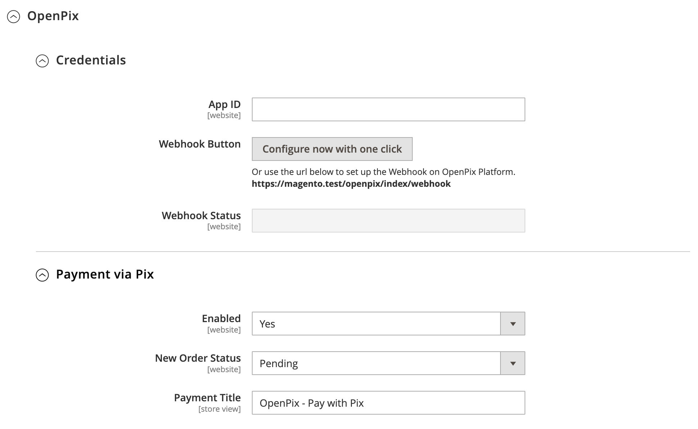
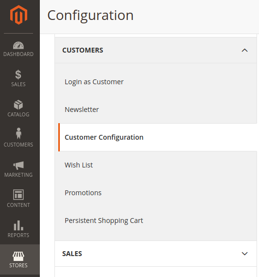

### Plugin Pix para Magento2

## Resumo

Este documento detalha passos necessários para conectar a sua plataforma de e-Commerce, baseada no Magento2, na OpenPix. A plataforma OpenPix efetua em tempo real a conciliação entre seu Banco e seu e-Commerce.
Após conectar a sua conta na OpenPix é possível cobrar clientes em tempo real com QrCodes Pix, enviar Links de Pagamento, gerenciar cobranças incluindo extornos.

> *Nota: Este documento espera que você já tenha um ambiente Magento2 ativo.*

## 1. Instale o Plugin OpenPix na sua instância Magento2

[OpenPix For Magento2](https://marketplace.magento.com/openpix-pix.html)

[Download OpenPix Magento2 Plugin - versão 2.0.10](pathname:///magento2/openpix_pix.2.0.10.zip) - Versão Atual

## 2. Configurando o Plugin Magento2

Entre em Magento2 Admin -> Stores > Configuration -> Sales -> Payment Method.

Clicando em em `Credentials` no Plugin OpenPix.

- [ ] Cadastre um AppID do tipo Plugin. Crie um appID [aqui](../../apis/api-getting-started.md)

Após adicionar o seu appID, clique em `Configure now with one click` para configurarmos ou criar seu Webhook. O Webhook é necessário para atualizar o status dos Pedidos em tempo real quando a cobrança Pix é paga.

- [ ] Ao clicar os campos, `Webhook Authorization` e `Webhook HMAC Secret Key` irão atualizar automaticamente e mostrar o status em `Webhook Status`.

- [ ] Caso não haja nenhum erro clique em `Save Config` para salvar as configurações.

Caso não configure, você pode acessar a plataforma, criar um webhook manualmente. Para isso:

- [ ] Crie uma senha para a integração do Webhook em `Webhook Authorization` clique em `Save Config`.
- [ ] Va até a plataforma OpenPix e acesse: `Admin -> API/Plugins -> Novo Webhook`
- [ ] A URL de Callback que deve ser utilizada no cadastro se encontra logo abaixo ao campo em que se registra a senha do webhook dentro da sua loja Magento2
- [ ] Clique em `Configure now with one click` novamente, para configurar o Webhook com esses novos dados criados.

Clicando em `Payment via Pix` no Plugin OpenPix.

- [ ] Ative ou Desative o Plugin
- [ ] Customize o título do pagamento dentro da sua Store

### 2.2 Configurando CPF/CNPJ para o Customer (opcional)

Para salvar o cpf/cnpj do customer da order na sua cobrança OpenPix é necessário que seja ativado o campo `TaxVat` em sua loja Magento.

**Obs: Caso você siga sem a configuração deste campo suas cobranças serão salvas sem o cliente da mesma.**

Entre em Magento2 Admin -> Stores > Configuration -> Customers -> Customer Configuration

Primeiro ative o campo `Show VAT Number on Storefront` em `Create New Account Options`:

Em seguida em `Name and Address Options` ative o campo `Show Tax/VAT Number`:

A partir de agora os clientes terão que preencher esse campo com o CPF ou CNPJ e o mesmo será usado para salvar o cliente na plataforma OpenPix.

## 3. Crie o Webhook dentro da Plataforma OpenPix

Ao configurar a Store volte para a Plataforma OpenPix e registre o Webhook que será responsável para atualizar sua Store Magento2 quando uma cobrança Pix for paga.

Para realizar o registro de um novo Webhook siga os passos abaixo:

- Va até a plataforma OpenPix e acesse: Admin -> API/Plugins -> Novo Webhook
- Utilize a mesma senha cadastrada em sua store Magento2. O Webhook é necessário para atualizar o status dos Pedidos em tempo real quando a cobrança Pix é paga.
- A URL de Callback que deve ser utilizada no cadastro se encontra logo abaixo ao campo em que se registra a senha do webhook dentro da sua Store Magento2. O padrão é: <https://youstore.com.br/openpix/index/webhook>

## 4. Realizar Pedido com Pix

Escolha a opção de pagar o pedido usando Pix

Pague o Pix usando o app do seu banco.

Valide que o status do Pedido mudou após o pagamento

## 5. Visualizar Pedido com Pix

Seu cliente poderá visualizar o pedido realizado via Pix dentro do detalhes do pedido. Basta clicar no botão que irá aparecer dentro da pagina de detalhe do pedido "Clique aqui para ver seu QRCode"

## Expiração

A OpenPix ira cuidar da expiração da cobrança Pix. Entretanto, é preciso que seja configurado em sua loja magento a expiração da order pois o mesmo cuidará de todo o processo.

Indicamos que a expiração/cancelamento da order no magento possua um tempo semelhante ao tempo configurado na OpenPix. Exemplo:
- tempo de expiração da cobrança OpenPix: 15 minutos
- coloque os mesmos 15 minutos dentro da sua loja Magento.

:::info
No magento você pode utilizar o lifetime order seguindo a doc abaixo:
- <https://docs.magento.com/user-guide/v2.3/sales/order-pending-payment-lifetime.html>
:::

## Atualizando o plugin
Indicamos aos clientes OpenPix estar sempre atualizados com a última versão do plugin. Você pode identificar a mesma no step de instalação.

Caso seu plugin esteja desatualizado basta seguir os passos do mesmo step de instalação e atualizar os arquivos do plugin em seu ecommerce.

## Debug

Para debugar o plugin OpenPix temos o arquivo de log e você encontra dentro de `var/log`:

- `openpix.log`: arquivo que concentra logs referentes ao processo de criação de um novo pedido Magento e consequentemente a charge no lado da OpenPix e o processo de atualização da Order quando paga.
