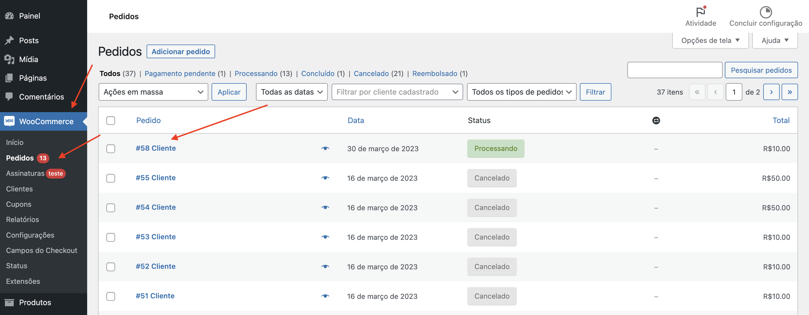
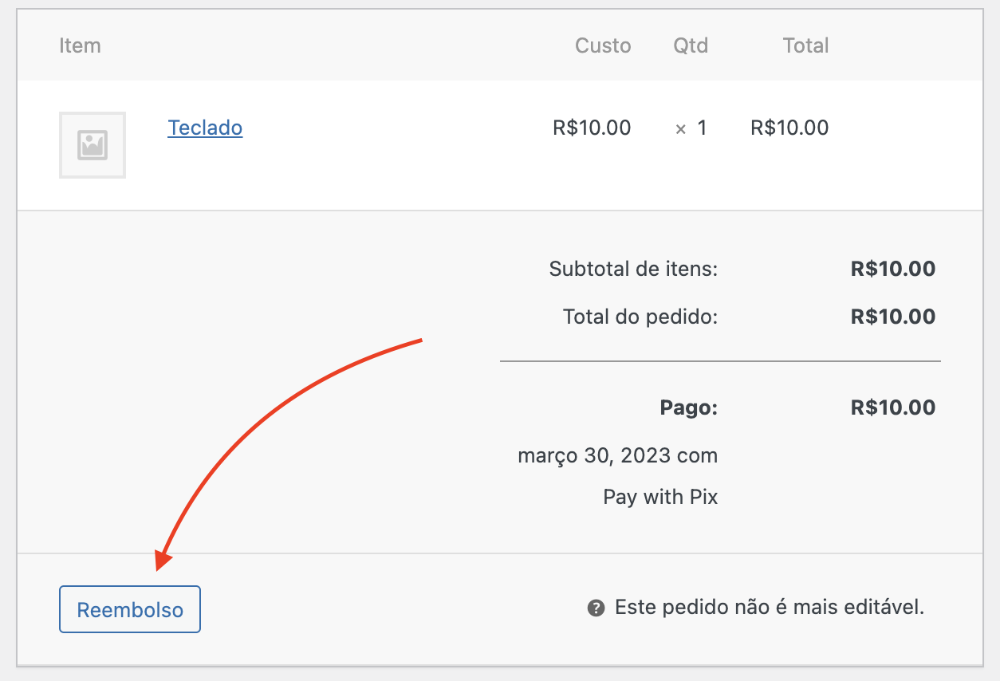
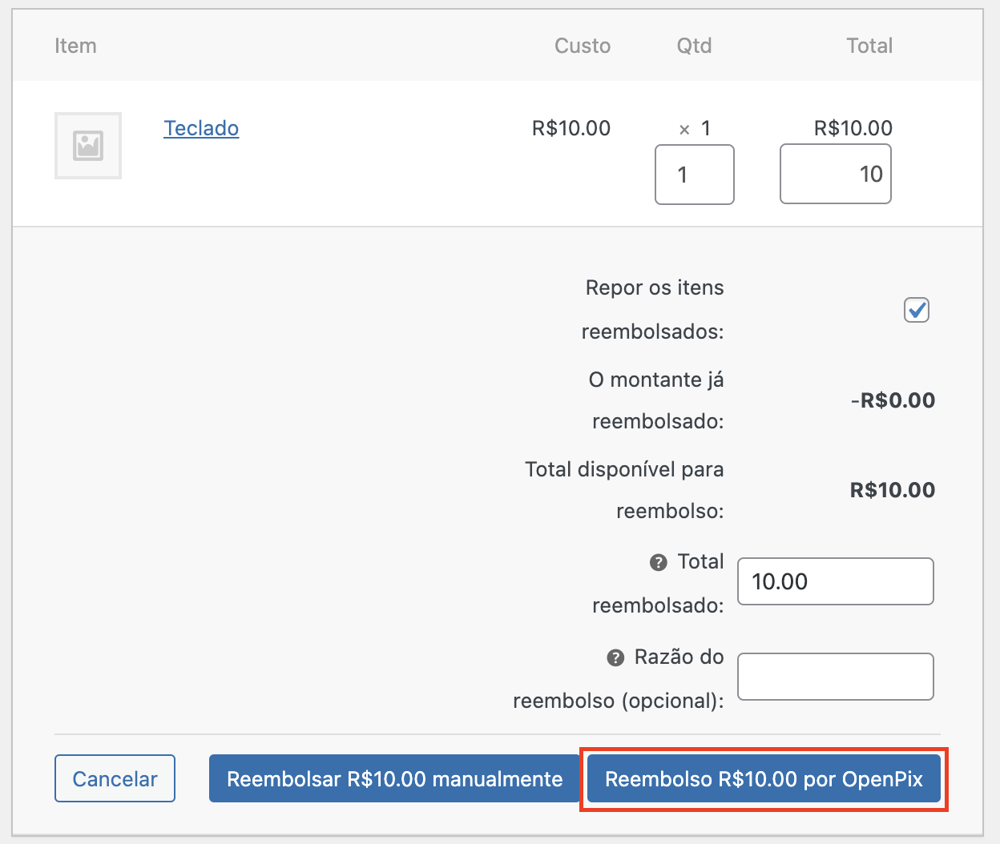
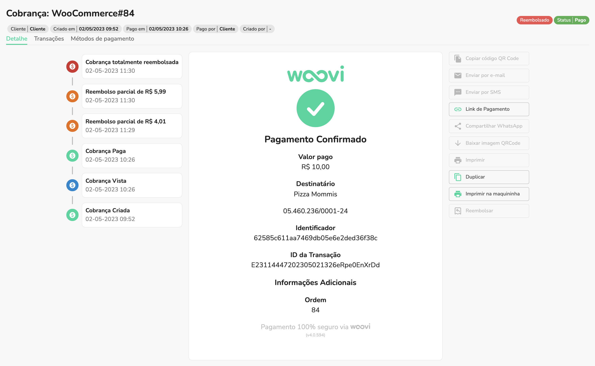
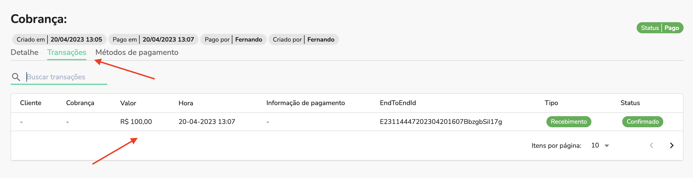
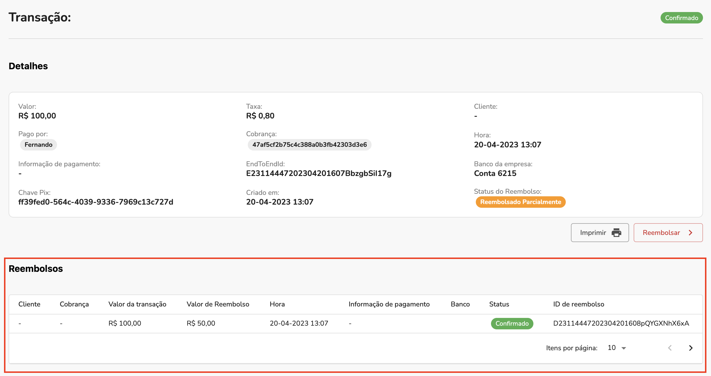

## 1. Abra os detalhes do pedido

No menu lateral, abra a lista de pedidos e então clique em um pedido já pago:

## 2. Click the refund button

Um pouco abaixo na página você verá uma seção com detalhes do pedido, clique no botão **Reembolsar**:

## 3. Preencha as informações e confirme o pedido

Neste passo você poderá configurar como o reembolso será feito:

- No campo **Qtd**, você decide a quantidade de items que serão reembolsados
- Selecione **Repor os itens reembolsados** se deseja que os itens voltem ao estoque
- Em **Total** você poderá definir o valor total do reembolso. Ele poderá ser menos que o valor total do pedido, resultando em um reembolso parcial.
- Também poderá definir o comentário do reembolso no campo **Razão do reembolso**.

Ao completar as informações, clique no botão **Reembolsar R$ XX,XX por OpenPix**:

## 4. Ver reembolsos da cobrança dentro da plataforma

Nos detalhes da cobrança dentro da plataforma você poderá ver o status do reembolso e os eventos:

Também é possível visualizar a lista de reembolsos:

abra a aba **Transações** e selecione a transação de pagamento da cobrança:

Nos detalhes da transação você poderá visualizar todos os reembolsos:

