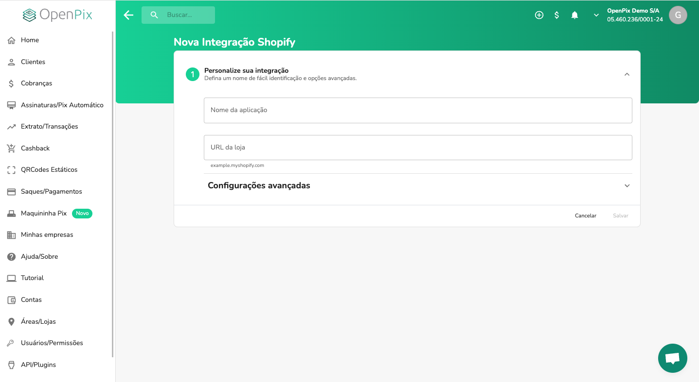
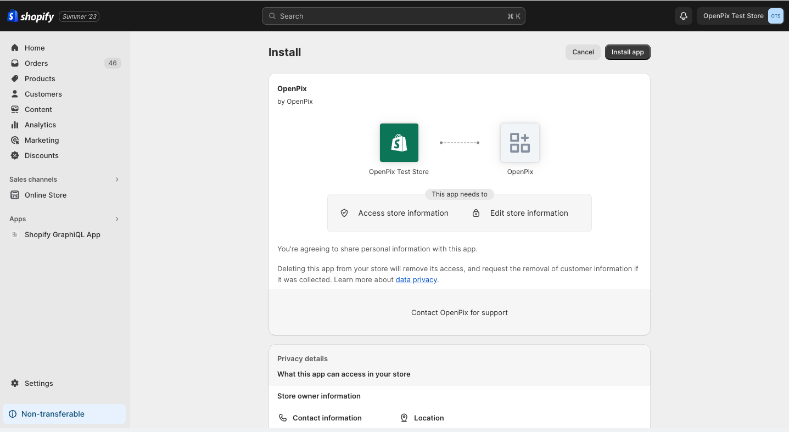
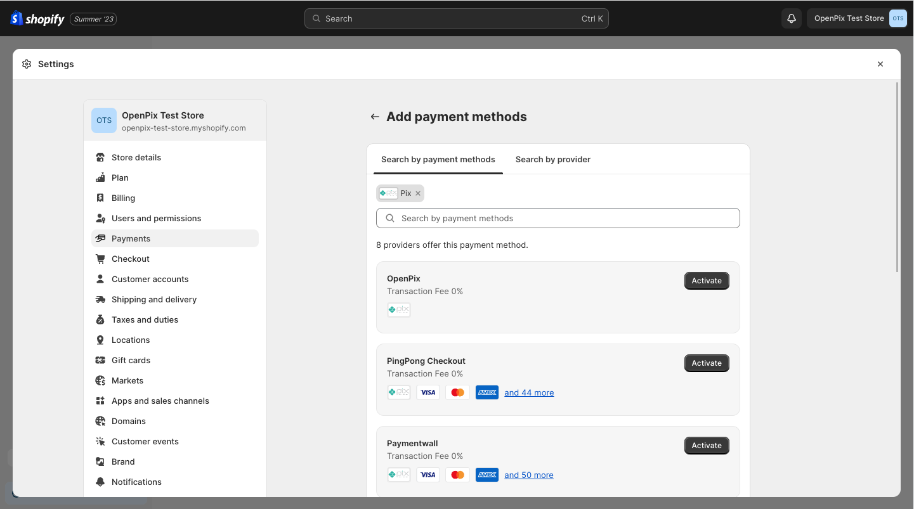
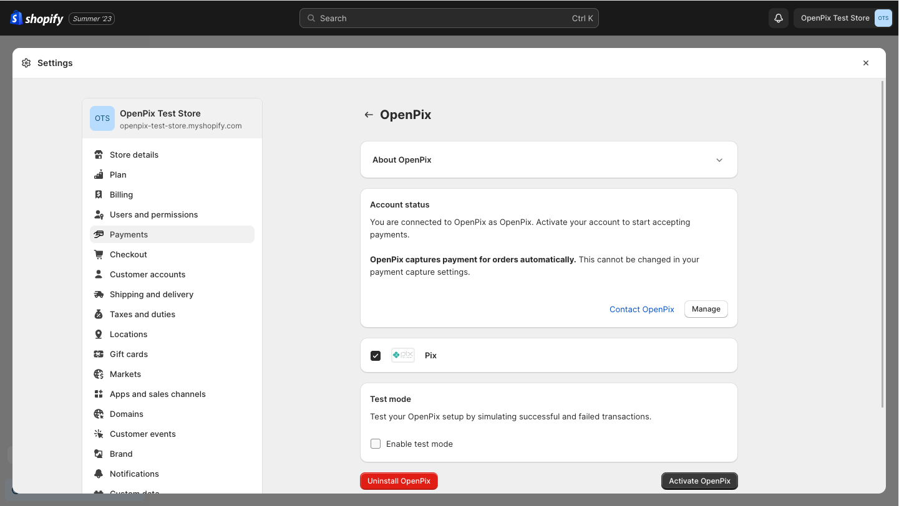

:::caution

This documentation expects that you already have an active Shopify store and an OpenPix account created.

:::

## 1. Creating a new application

To integrate your Shopify store with OpenPix, you need to create an application related to this integration.

To create a new application, you can do one of the following:

- Directly accessing the creation form by clicking [here](https://app.openpix.com/home/applications/shopify/add);
- After accessing the [OpenPix](https://app.openpix.com/home) platform, you can access it through the menu, clicking on:
   1. API/Plugins;
   2. Shopify;
   3. Click on the `Add` button;

After following one of these flows, you will be redirected to the application creation form, as shown in the image below:

After filling in the following information:

1. **Application name**: the name by which you want to identify this integration within OpenPix;
2. **Store URL**: The URL of your Shopify store. Example: `example.myshopify.com`.

You can click the `Save` button and the application will be created. After creation, you will be redirected to the
Shopify where it will proceed with installing and integrating the app.

:::info

We only allow one integration related to that store URL. If you try to create a new application
with the same store URL, we will not allow it.

:::

## 2. Installing the app on Shopify

After being redirected to Shopify, you will be asked to install the app. You will be redirected
to the following screen:

Click on the `Install app` button in the upper right corner to authorize and proceed with the installation.

After clicking, if the authentication process has occurred correctly, you will be redirected to the detail
of the app in Shopify. Thus, your installation completed correctly.

To be using OpenPix's Pix as a payment method in your store, you will need to enable it as
a payment method from your store.

## 3. Enabling the App as a payment method

To enable Pix as a payment method, you must access the `Settings` menu and click on `Payments`.

1. In the `Additional Payment Methods` section, click on the button: `Add payment method`.
2. In the search for payment methods tab, type `Pix`.
3. Search for the `OpenPix` payment method.
4. Click on the `Activate` button.

After clicking on `Activate`, you will be taken to the detail page for that payment method. To activate
OpenPix, just click on the `Activate OpenPix` button, in the lower right corner, as shown in the image below:

## 4. Completing activation

Once you've clicked the `Activate OpenPix` button, you can start receiving payments via Pix in your Shopify store!

At your store checkout, the `Pix (OpenPix)` payment method will be available and your customers may be using it.
